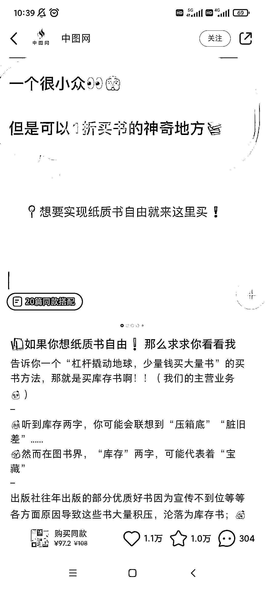
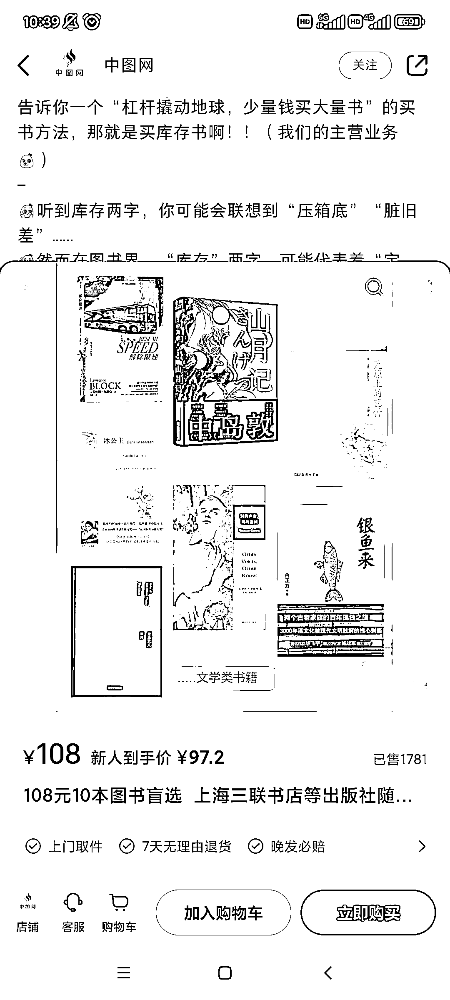

# 小红书卖打折书的套路，从“书店倒闭清仓，转成做打折库存书”卖书

> 原文：[`www.yuque.com/for_lazy/xkrm14/of3c7dclkgf17zg0`](https://www.yuque.com/for_lazy/xkrm14/of3c7dclkgf17zg0)

<ne-p id="u8413f35a" data-lake-id="u8413f35a"><ne-text id="u00a0cfe2">作者： 阿黎</ne-text></ne-p> <ne-p id="u896a76d4" data-lake-id="u896a76d4"><ne-text id="u0be686b8">日期：2023-05-08</ne-text></ne-p> <ne-p id="u7e43d243" data-lake-id="u7e43d243"><ne-text id="uabb79920">点赞数：</ne-text><ne-text id="ued8c553b" ne-bold="true">41</ne-text></ne-p> <ne-hole id="u65b8736c" data-lake-id="u65b8736c"><ne-card data-card-name="hr" data-card-type="block" id="yLA9J" data-event-boundary="card"><ne-p id="u69f00b95" data-lake-id="u69f00b95"><ne-text id="ud1dc97ce">正文：</ne-text></ne-p> <ne-p id="u337b4481" data-lake-id="u337b4481"><ne-text id="u9d571529">卖打折书的套路，从“书店倒闭清仓，转成做打折库存书”卖书 首先，笔记首图 1 折买书方法吸引人，其次，笔记内容讲主营库存书，打造人设 图 1</ne-text> <ne-text id="ue822e111">第三，点开笔记链接，是图书盲盒，10 本 108 元，图 2，卖了 1781 单! —— 我的理解，这玩法妙在 3 点 1 用揭秘占便宜的窍门来引流 2</ne-text> <ne-text id="u726f3361">立人设——用清仓打折的概念，转成所谓库存书，让你觉得便宜，并且立了人设——我专门做库存书的，以后买书便宜继续来找我</ne-text> <ne-text id="ucdbe5f76">*清仓是有时效的，过一年你还在清仓就被认为是骗子，不可持续，同时清仓代表货物属于尾货残次——库存没有时效，有你来挖宝的感觉，还建立了出版社库存的可靠人设 3</ne-text> <ne-text id="u8f828a72">用打包 10 本的方式，重新定义了一个价格体系，不好和其他渠道对比价格，让顾客察觉不到价格；用”盲盒”形式，打包好卖的和不好卖的品类，</ne-text></ne-p> <ne-p id="uec0c4ea1" data-lake-id="uec0c4ea1"><ne-card data-card-name="image" data-card-type="inline" id="Mstuq" data-event-boundary="card">  <ne-p id="u120c3ddc" data-lake-id="u120c3ddc"><ne-card data-card-name="image" data-card-type="inline" id="ufZSF" data-event-boundary="card"></ne-card></ne-p> <ne-hole id="u4bc97959" data-lake-id="u4bc97959"><ne-card data-card-name="hr" data-card-type="block" id="wVdoD" data-event-boundary="card"><ne-p id="u0b65e7c7" data-lake-id="u0b65e7c7"><ne-text id="uad7c91bd">评论区：</ne-text></ne-p> <ne-p id="u08f15d96" data-lake-id="u08f15d96"><ne-text id="u5dcb88ef">海艳 : 这个在小红书上需要开通图书类的许可证吗？</ne-text></ne-p> <ne-p id="u5993146b" data-lake-id="u5993146b"><ne-text id="uecd4acf3">岁月静好. : 同问</ne-text></ne-p> <ne-p id="u03dbbcfc" data-lake-id="u03dbbcfc"><ne-text id="ubaabcd77">Luke 王子 : 其实你们可以直接问 小红书客服的； 我之前问过了，小红书个体+出版物许可，就能开店，和咸鱼资质一样； 抖音是公司资质+出版物许可；不支持个体</ne-text></ne-p> <ne-p id="u4fb0af70" data-lake-id="u4fb0af70"><ne-text id="ub7cff6c7">岁月静好. : 谢谢</ne-text></ne-p> <ne-p id="ud16c4e46" data-lake-id="ud16c4e46"><ne-text id="u39a6f1c3">阿黎 : 你在开店铺那里，开到那一步，就会有各类资质要求了</ne-text></ne-p> <ne-hole id="ude653fa2" data-lake-id="ude653fa2"><ne-card data-card-name="hr" data-card-type="block" id="wrPDv" data-event-boundary="card"><ne-p id="u069e8470" data-lake-id="u069e8470"><ne-text id="u72ca0c56">公众号懒人找资源，懒人专属群分享</ne-text></ne-p></ne-card></ne-hole></ne-card></ne-hole></ne-card></ne-p></ne-card></ne-hole>