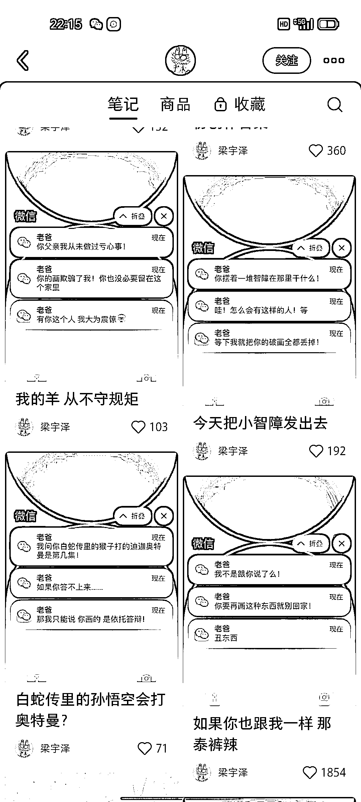
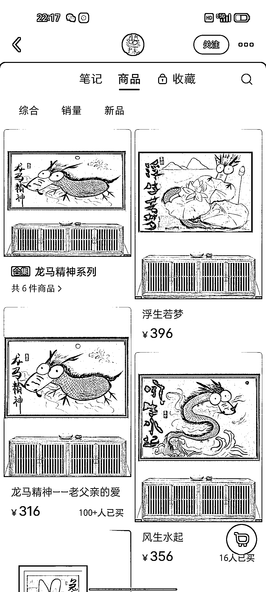

# 小红书用微信弹窗封面，吸引流量卖高客单的画

> 原文：[`www.yuque.com/for_lazy/xkrm14/xhpf2tygyh5ugpgc`](https://www.yuque.com/for_lazy/xkrm14/xhpf2tygyh5ugpgc)

作者： 明月几时有

日期：2023-05-06

点赞数：133

<ne-card data-card-name="hr" data-card-type="block" id="NhV8F" data-event-boundary="card">

正文：

用微信弹窗封面，吸引流量，卖高客单的画 模仿微信弹窗发笔记，卖其他的也可以

<ne-card data-card-name="image" data-card-type="inline" id="Bt6cg" data-event-boundary="card"></ne-card>

<ne-card data-card-name="image" data-card-type="inline" id="hyZ1U" data-event-boundary="card"></ne-card>

<ne-card data-card-name="hr" data-card-type="block" id="iHZS9" data-event-boundary="card">

评论区：

闫君 : 用什么软件做的？

米斯特 LIu : 同问

明月几时有 : 大号给小号发，，我上篇笔记有制作聊天生成的

富饶大地 : 龙岩的[得意]

小山 : 妙啊

孙伟悦 : 666

<ne-card data-card-name="hr" data-card-type="block" id="E4Xzq" data-event-boundary="card">

公众号懒人找资源，懒人专属群分享

</ne-card></ne-card></ne-card>