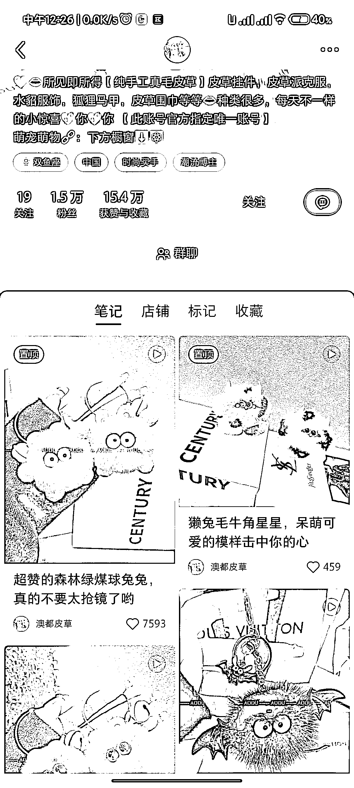

# 挖掘小红书小而美店铺（3）：击中少女心的皮草挂件

> 原文：[`www.yuque.com/for_lazy/xkrm14/fwlf3dcnpt30wzlm`](https://www.yuque.com/for_lazy/xkrm14/fwlf3dcnpt30wzlm)

作者： 落落

日期：2023-05-06

点赞数：92

正文：

挖掘小红书小而美店铺（3）- 可可爱爱，击中少女心的皮草挂件 入选标准：门槛低、无需带货技巧、粉少销量高。 带货表现：销量/粉丝达到 4 倍，表现很不错。 pdd 上零售价可在 5 元左右，店铺客单价 10 - 30 元之间。 带货方式： 视频，全方位动态展示产品环节，效果比图文好。 特点： 无需太多带货技巧，无需露脸，发货周期宽泛 标题文案：与产品匹配的可爱、俏皮的文案～

评论区：

落落 : 谢谢

大蜂 : 小红书这种小而美的店铺，真的好多哈哈，我也收集了好多，几乎每一个垂直细分品类都有这么几家，比如苹果手机壳，乳山生蚝等等，这类生意天花板，低一点是做成小红书里的品牌 IP，高一点则做成完美日记那样的某一品类的网红品牌 IP

落落 : 是的，我也在搜罗中，挑选规模比较小的，刚开始做小红书可以作为对标。

公众号懒人找资源，懒人专属群分享

