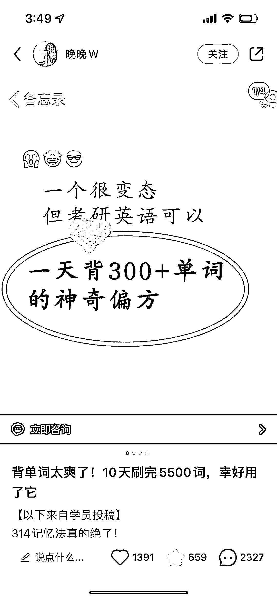

# 各行业通用的小红书爆款选题： “一个很...但可以...的神奇偏方”

> 原文：[`www.yuque.com/for_lazy/xkrm14/loylu3dixxq2x0hp`](https://www.yuque.com/for_lazy/xkrm14/loylu3dixxq2x0hp)

<ne-text id="uf7302ba6">作者： +1</ne-text>

<ne-text id="ub4f05797">日期：2023-05-05</ne-text>

<ne-text id="u0426c337">点赞数：</ne-text><ne-text id="uf8faba5c" ne-bold="true">124</ne-text>

<ne-hole id="u1891955e" data-lake-id="u1891955e"><ne-card data-card-name="hr" data-card-type="block" id="BZH7t" data-event-boundary="card">

<ne-text id="u46ba85a6">正文：</ne-text>

<ne-text id="u4f505178">分享一个小红书爆款选题，各行业通用 已经在各行业看到无数次了 “一个很...但可以...的神奇偏方”</ne-text>

<ne-card data-card-name="image" data-card-type="inline" id="RRfyD" data-event-boundary="card"></ne-card>

<ne-card data-card-name="image" data-card-type="inline" id="JgB85" data-event-boundary="card"></ne-card>

<ne-card data-card-name="image" data-card-type="inline" id="X8lGn" data-event-boundary="card"></ne-card>

<ne-card data-card-name="image" data-card-type="inline" id="R2Blv" data-event-boundary="card"></ne-card>

<ne-hole id="u0b452ded" data-lake-id="u0b452ded"><ne-card data-card-name="hr" data-card-type="block" id="QDSeJ" data-event-boundary="card">

<ne-text id="ufd170f53">评论区：</ne-text>

<ne-text id="u7edebdfd">朱朱侠 : 我现在就把这个爆款标题模型喂给 ChatGPT</ne-text>

<ne-text id="uc787d885">+1 : 哈哈 肥肠棒</ne-text>

<ne-text id="u5bebd732">朱朱侠 : 大佬带领的好</ne-text>

<ne-text id="ube238f3a">朱朱侠 : 已经测试过了，不过还没来得及优化关键词，感谢大佬提供的内容。</ne-text>

<ne-text id="ueab3efc9">+1 : 给你一个大大的👍</ne-text>

<ne-hole id="uda1f9987" data-lake-id="uda1f9987"><ne-card data-card-name="hr" data-card-type="block" id="e9iK1" data-event-boundary="card">

<ne-text id="ufb705c5b">公众号懒人找资源，懒人专属群分享</ne-text>

</ne-card></ne-hole></ne-card></ne-hole></ne-card></ne-hole>