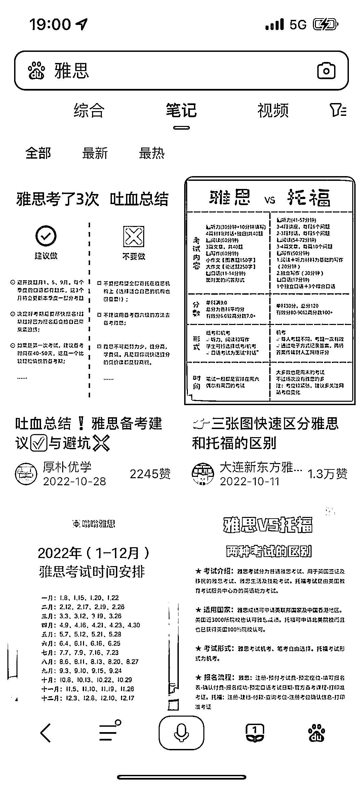

# 新版百度 app 给了小红书笔记顶部的 tag 位，巨大的流量

> 原文：[`www.yuque.com/for_lazy/xkrm14/zk4p8n4thai8yevx`](https://www.yuque.com/for_lazy/xkrm14/zk4p8n4thai8yevx)

作者： 请叫我娃哥

日期：2023-05-04

点赞数：62

正文：

新版百度 app 给了小红书笔记顶部的 tag 位，巨大巨大的流量！我也

评论区：

请叫我娃哥 : 哇 谢谢亦仁大大～

成亘 : 没明白，怎么才能占到这种位置呢

请叫我娃哥 : 做关键词

公众号懒人找资源，懒人专属群分享

