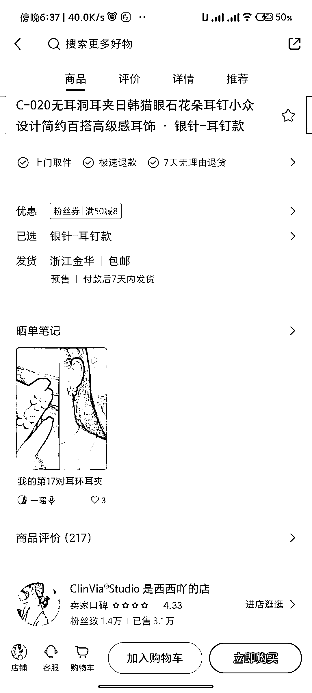

# 挖掘小红书小而美店铺（1）无耳洞耳夹

> 原文：[`www.yuque.com/for_lazy/xkrm14/kab2mg3su83lr2co`](https://www.yuque.com/for_lazy/xkrm14/kab2mg3su83lr2co)

<ne-text id="u81d8c204">作者： 落落</ne-text>

<ne-text id="uc182689e">日期：2023-05-04</ne-text>

<ne-text id="uf07b1b79">点赞数：</ne-text><ne-text id="u3a14ced3" ne-bold="true">60</ne-text>

<ne-hole id="u085d4591" data-lake-id="u085d4591"><ne-card data-card-name="hr" data-card-type="block" id="oYrlJ" data-event-boundary="card">

<ne-text id="ue5b53cce">正文：</ne-text>

<ne-text id="uf3eec2b1">挖掘小红书小而美店铺（1）- 无耳洞耳夹 方式：简单的图文介绍，视频，侧脸展示耳钉。不露脸，视频增加动态展示产品环节，全程只有背景音乐，无需太多带货技巧。</ne-text> <ne-text id="u25617bcc">标题文案：我的 365 对耳夹，我的 1000 对耳夹，系列成文突出品类丰富。 带货表现：粉丝几 k 到 1 万不等，销量都不错。 pdd 上价格都在 10</ne-text> <ne-text id="uc4a47fd8">元以内，店铺客单价 10-30 元不等。</ne-text>

<ne-card data-card-name="image" data-card-type="inline" id="uKDDm" data-event-boundary="card">  <ne-p id="u062b0358" data-lake-id="u062b0358"><ne-card data-card-name="image" data-card-type="inline" id="bNiuW" data-event-boundary="card"></ne-card>

<ne-card data-card-name="image" data-card-type="inline" id="TVSeO" data-event-boundary="card"></ne-card>

<ne-hole id="uf027925b" data-lake-id="uf027925b"><ne-card data-card-name="hr" data-card-type="block" id="jg1Y5" data-event-boundary="card">

<ne-text id="ufdddf713">评论区：</ne-text>

<ne-text id="u513a10a2">落落 : 谢谢</ne-text>

<ne-text id="u17324afd">小张 : 这种看着简单 实际上不好做</ne-text>

<ne-text id="u459c3622">落落 : 比如哪个环节会不好做，可以分享下吗？</ne-text>

<ne-text id="uc234bdd8">九京 : 关注你了，多多更新</ne-text>

<ne-text id="ub38c1fad">落落 : 谢谢，不负期待[愉快]</ne-text>

<ne-text id="u40363278">方糖呐 : 期待展开讲讲～</ne-text>

<ne-text id="u1b198f1b">游民 : 应该是实践经验，很期待分享</ne-text>

<ne-hole id="uc939aafc" data-lake-id="uc939aafc"><ne-card data-card-name="hr" data-card-type="block" id="JdiRA" data-event-boundary="card">

<ne-text id="ub0c001be">公众号懒人找资源，懒人专属群分享</ne-text>

</ne-card></ne-hole></ne-card></ne-hole></ne-card></ne-p></ne-card></ne-hole>