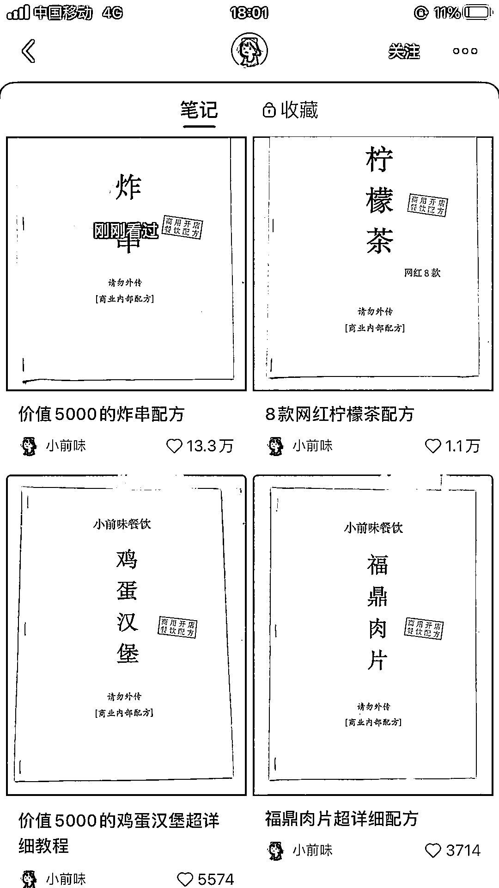
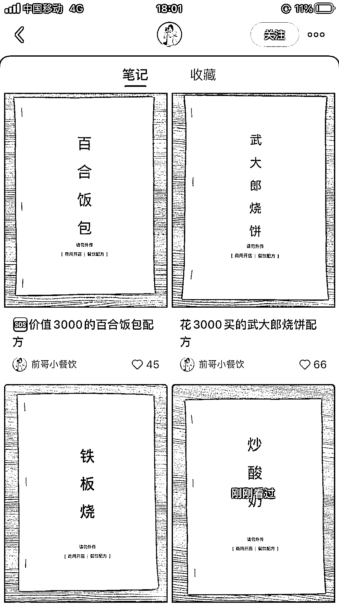

# 小红书分享小吃培训配方，可引流，卖配方培训

> 原文：[`www.yuque.com/for_lazy/xkrm14/netrkdq6ux7mnzak`](https://www.yuque.com/for_lazy/xkrm14/netrkdq6ux7mnzak)

作者： 子桐

日期：2023-05-04

点赞数：62

正文：

小红书分享小吃培训配方，可引流，卖配方，培训

评论区：

苓枫 : 这个我昨天也看到了，4 条笔记涨了一万粉

子桐 : 这个上个月有看到，忘记发出来了，嘻嘻

吱吱的画 : 这个素材哪里来呀

Sunshine : 这种形式的展现方式不错啊，成本低

孔孔孔孔孔. : pdd 有卖素材，下载后重新 word 整理打印，或者截图纸质，然后 tb 定制个章

公众号懒人找资源，懒人专属群分享

