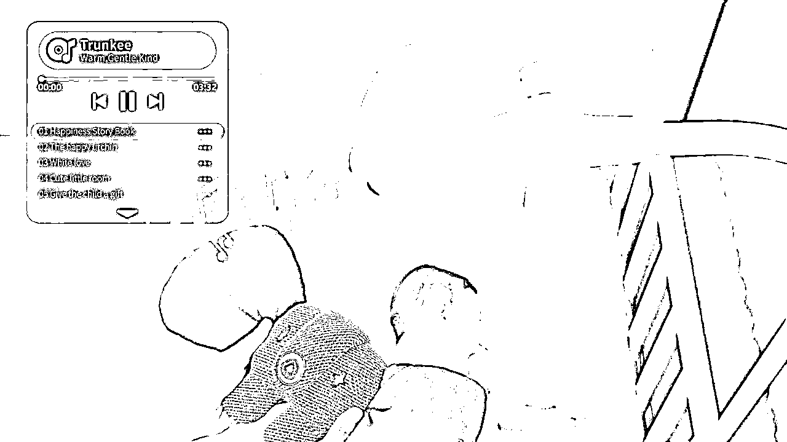

# 二千零二十三、德国 iF 奖出炉

> 原文：[`www.yuque.com/for_lazy/xkrm14/gwdrkn1ckr7vubwk`](https://www.yuque.com/for_lazy/xkrm14/gwdrkn1ckr7vubwk)

<ne-text id="u080648b3">作者： 少儿探索科学实验室</ne-text>

<ne-text id="ud6c28fb1">日期：2023-05-04</ne-text>

<ne-text id="u36f0790d">点赞数：</ne-text><ne-text id="u8b897a30" ne-bold="true">62</ne-text>

<ne-hole id="u6c15d71d" data-lake-id="u6c15d71d"><ne-card data-card-name="hr" data-card-type="block" id="Rq8bX" data-event-boundary="card">

<ne-text id="u8597ab6f">正文：</ne-text>

<ne-text id="uaff0cae2">2023 德国 iF 奖出炉 哪些玩具婴童用品获奖了？ Pixsee Play & Friends 智能婴儿相机和互动玩具套装</ne-text> <ne-text id="u90809bb6">这是一款智能婴儿相机和引人入胜的玩具套装，包括智能检测婴儿睡眠和移动安全、自动播放旋律安抚哭声的音乐播放器，全球首款破译哭声原因的解码器等功能。套装中包含三个伴侣玩具，通过独特策划的歌曲吸引孩子们刺激认知游戏，可以通过</ne-text> <ne-text id="ua5da71df">AI 技术捕捉亲子时刻，在云端留下持久的回忆。</ne-text> [<ne-text id="u2c17c9ed">2023 德国 iF 奖出炉++哪些玩具婴童用品获奖了？</ne-text>](https://mp.weixin.qq.com/s/5XijqU9ZFd8fJdB2xi3mlA)

<ne-card data-card-name="image" data-card-type="inline" id="Pcyc2" data-event-boundary="card">  <ne-hole id="u7dcb8554" data-lake-id="u7dcb8554"><ne-card data-card-name="hr" data-card-type="block" id="FwQOb" data-event-boundary="card"><ne-p id="ub7d09a21" data-lake-id="ub7d09a21"><ne-text id="u9230eadb">评论区：</ne-text>

<ne-text id="ub5603d48">万能神 : 高科技时代的前锋</ne-text>

<ne-text id="u7e9ed6fe">水丰 : 我们公司也开发有一款类似的，功能高度重合儿童看护机器摄像头，我怀疑我们产品经理在规划产品功能的时候看了这款产品😂</ne-text>

<ne-text id="u2cd31b9f">少儿探索科学实验室 : 可以学习借鉴啊，非常看好这款产品</ne-text>

<ne-text id="ud7bfaf37">水丰 : 可以对比一下，功能上差不多</ne-text>[<ne-text id="uc7aa1e6b">重磅首发：小值 AI 儿童看护机器人，开启“电子保姆”安全看护新体验！</ne-text>](https://mp.weixin.qq.com/s/grkq1ocifRysKZuPSyUWYw)

<ne-text id="u0caf1d3e">少儿探索科学实验室 : 可以交流一下 letaokexue</ne-text>

<ne-text id="uef60b797">周梦行 : 很好奇这类智能产品在小孩子眼里是什么样的[捂脸]</ne-text>

<ne-hole id="u8e098ef3" data-lake-id="u8e098ef3"><ne-card data-card-name="hr" data-card-type="block" id="quKku" data-event-boundary="card">

<ne-text id="u110620d1">公众号懒人找资源，懒人专属群分享</ne-text>

</ne-card></ne-hole></ne-card></ne-hole></ne-card></ne-p></ne-card></ne-hole>