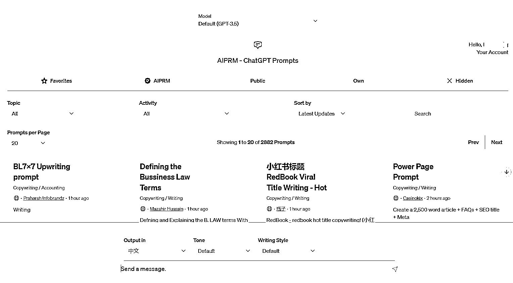
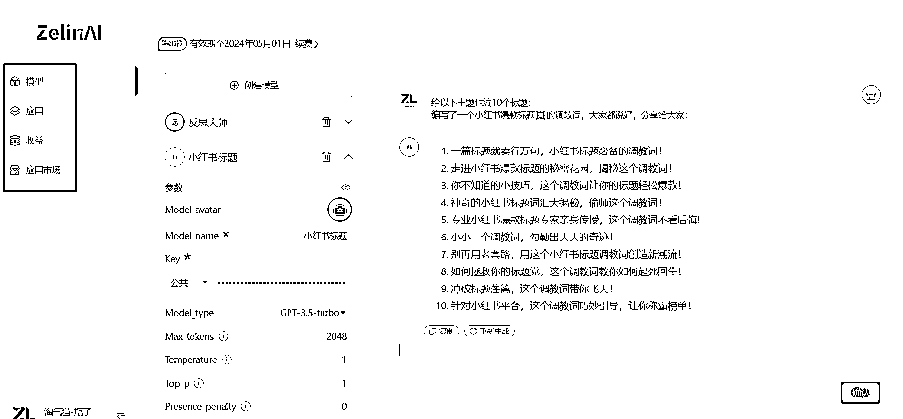
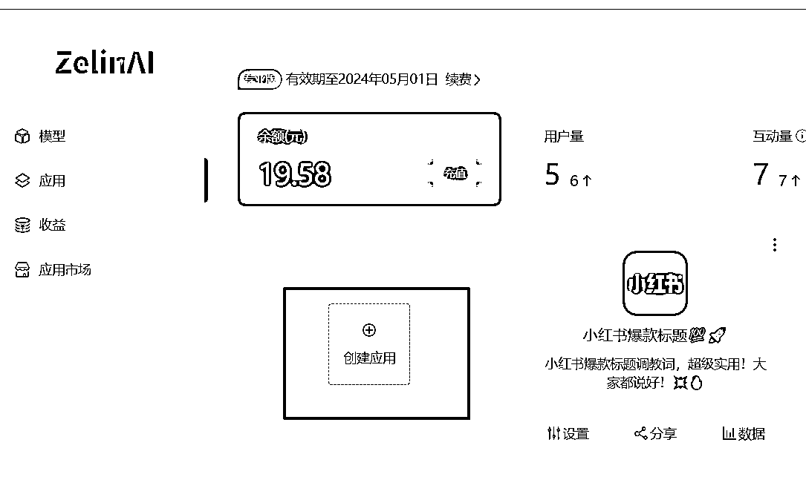

# AI 应用市场雏形

> 原文：[`www.yuque.com/for_lazy/xkrm14/qt047hn59mmw3xr9`](https://www.yuque.com/for_lazy/xkrm14/qt047hn59mmw3xr9)

作者： 淘气猫（瓶子）

日期：2023-05-03

点赞数：69

正文：

AI 应用市场雏形 当前，市面上大部分 gpt 工具是简单的代理站或附加一些调教模板，这种模式使得使用范围相对固化，不利于网站内容的拓展。 然而，平台的思路逐渐崭露头角，国外的案例，如 aiprm 插件市场、flowgpt 模板市场等。 在国内，类似的平台也已经出现，尽管尚未公开开放，但发展思路很有野心。 这个 zelinai 的平台，用户只需简单配置参数和填写调教词，即可创建一个 AI 应用，可以免费，也可以按使用时长或次数收费，平台则负责维护一个应用市场。 这种模式能吸引更多普通人参与进来，丰富 AI 应用的种类和功能。双赢 chatgpt

  

  

  

评论区：

程序员 HeyLinn : 请问，第一张图，是什么软件？

淘气猫（瓶子） : flowgpt.com

公众号懒人找资源，懒人专属群分享

