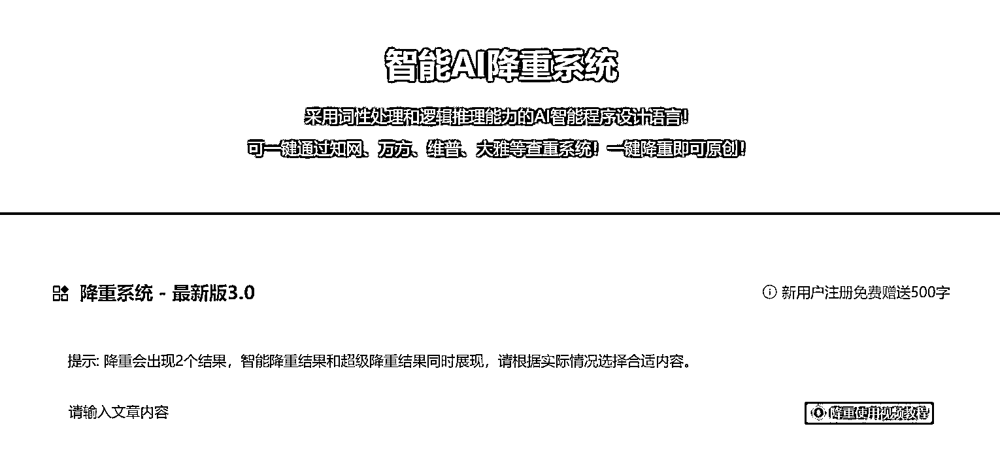

# AI 降重论文

> 原文：[`www.yuque.com/for_lazy/xkrm14/coz1qpksa29w18ff`](https://www.yuque.com/for_lazy/xkrm14/coz1qpksa29w18ff)

作者： 熊自由

日期：2023-05-03

点赞数：29

<ne-hole id="u871356e2" data-lake-id="u871356e2"><ne-card data-card-name="hr" data-card-type="block" id="JKBU6" data-event-boundary="card">

正文：

Ai 降重论文 搜自己论文相关关键词的时候发现排名第一的做了 seo 的广告，点进去看，映入眼帘的不是以前卖天价知网查重的了，通过 ai 帮大学生解决论文相关问题，听曹大说去年在国外就已经流行起来。 普通人不会搭建这个入口的，可以通过机刷薅这个同行的免费分享奖励，然后通过闲鱼去接大学生的降重单子

<ne-card data-card-name="image" data-card-type="inline" id="Q1231" data-event-boundary="card">  <ne-p id="ucdcd3535" data-lake-id="ucdcd3535"><ne-card data-card-name="image" data-card-type="inline" id="YBGzt" data-event-boundary="card">  <ne-p id="u2415c2f9" data-lake-id="u2415c2f9"><ne-card data-card-name="image" data-card-type="inline" id="izcRY" data-event-boundary="card">  <ne-hole id="u7afc510b" data-lake-id="u7afc510b"><ne-card data-card-name="hr" data-card-type="block" id="lrXDv" data-event-boundary="card"><ne-p id="uf5ba1932" data-lake-id="uf5ba1932">评论区：

lydia : 请问这个是什么网站

熊自由 : 百度或者啥搜索引擎直接一搜就会有。。

镜音 : 大学老师一般建议学生不要去网上查重，容易造成论文泄露

林家少爷 : 一般都是去知网查重

水木目 : 我们老师叫我们先上网自己查，降到一定比例，才知网查[捂脸]

镜音 : 我们老师只让我们用知网和维普查[撇嘴]学校给了两次免费查重，超过就要自己付费

晓玲 : 可以通过机刷薅这个同行的免费分享奖励,这个能解释一下吗？

<ne-hole id="u6eb759af" data-lake-id="u6eb759af"><ne-card data-card-name="hr" data-card-type="block" id="TLmip" data-event-boundary="card">

公众号懒人找资源，懒人专属群分享

</ne-card></ne-hole></ne-card></ne-hole></ne-card></ne-p></ne-card></ne-p></ne-card></ne-p></ne-card></ne-hole>