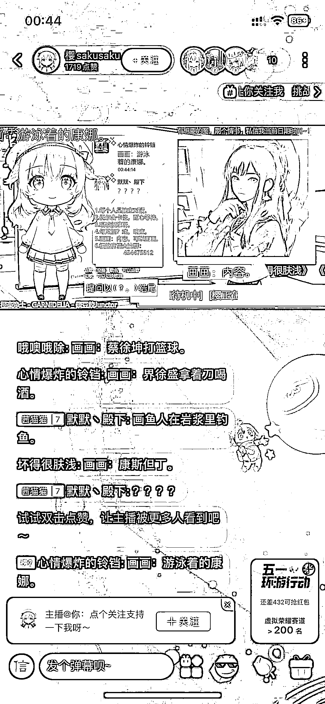

# 抖音全 AI 直播，ChatGPT 结合 AI 绘图

> 原文：[`www.yuque.com/for_lazy/xkrm14/nraqwchxoqqzg6y7`](https://www.yuque.com/for_lazy/xkrm14/nraqwchxoqqzg6y7)

作者： 郁离居士

日期：2023-05-03

点赞数：46

<ne-hole id="u6acf0a56" data-lake-id="u6acf0a56">

正文：

【全 AI 直播】ChatGPT 结合 AI 绘图 观众通过弹幕与 AI 交流 支持聊天、点歌、绘图 赠送礼物即可保存绘图内容

  <ne-hole id="u772fc108" data-lake-id="u772fc108"><ne-p id="u9004befd" data-lake-id="u9004befd">评论区：

bororolily : 这个项目太好了，问题是怎么做到呢？想参与！

郁离居士 : 我是在哔哩哔哩看到的 搜索 AI 虚拟主播可以看到详细配置教程 可以试试看 例如这个：【【AI 虚拟主播】教你安装到开播,ChatGPT 弹幕语音回复,手把手教学!快来领你的纸片人老婆!-哔哩哔哩】 [【AI 虚拟主播】教你安装到开播,ChatGPT 弹幕语音回复,手把手教学!快来领你的纸片人老婆!_ 哔哩...](https://b23.tv/6KUUv4L)

郁离居士 : 这个是最基础的 ChatGPT 聊天配置 其余的功能就得一个个分别搜索教程啦 加油

bororolily : 感谢老师[奋斗][奋斗][抱拳][抱拳][抱拳]

<ne-hole id="u387544f7" data-lake-id="u387544f7">

公众号懒人找资源，懒人专属群分享

</ne-hole></ne-hole></ne-p></ne-hole>