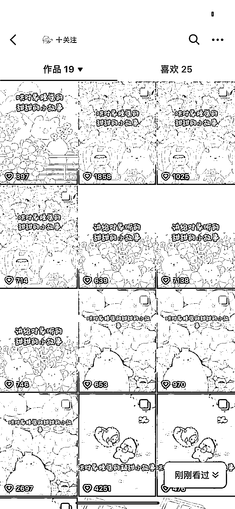

# 抖音用 ChatGPT 批量生产睡前小故事

> 原文：[`www.yuque.com/for_lazy/xkrm14/qs6arpg6xfg77535`](https://www.yuque.com/for_lazy/xkrm14/qs6arpg6xfg77535)

<ne-text id="u256eaa68">作者： 小哈</ne-text>

<ne-text id="u04b5bded">日期：2023-05-03</ne-text>

<ne-text id="u646052d8">点赞数：</ne-text><ne-text id="u3313e7fc" ne-bold="true">110</ne-text>

<ne-hole id="u764af395" data-lake-id="u764af395"><ne-card data-card-name="hr" data-card-type="block" id="S9kwV" data-event-boundary="card">

<ne-text id="u8cba9696">正文：</ne-text>

<ne-text id="u7829ffc4">用 chatgpt 批量生产睡前小故事，用 ai 配音，可以发中视频，喜马拉雅。</ne-text>

<ne-card data-card-name="image" data-card-type="inline" id="qUMXc" data-event-boundary="card">  <ne-hole id="u599e21be" data-lake-id="u599e21be"><ne-card data-card-name="hr" data-card-type="block" id="BL8a6" data-event-boundary="card"><ne-p id="u4d1acc33" data-lake-id="u4d1acc33"><ne-text id="u3f0fc708">评论区：</ne-text>

<ne-text id="ue6e6463d">朱朱侠 : 刚刚用 ChatGPT 试了一下，故事写的确实还挺可以的，貌似懂心理学</ne-text>

<ne-text id="u3156a303">小哈 : 👍👍👍</ne-text>

<ne-text id="u9a80a1c7">潜龙卧海 : 流程知道了，细节要自己好好跑一下，期待出航海</ne-text>

<ne-text id="u20542a71">林家少爷 : 很好奇这个具体要怎么变现呢 钱从哪里来</ne-text>

<ne-text id="ue0d7bcfb">小哈 : 中视频有播放就有收益，喜马拉雅可以带广告，两者都可以引流到私域，直接从 pdd 买更多小故事打包卖给客户。</ne-text>

<ne-text id="u18f50ee1">小哈 : 好的，谢谢亦仁大大！</ne-text>

<ne-hole id="ua059f3e7" data-lake-id="ua059f3e7"><ne-card data-card-name="hr" data-card-type="block" id="Xf20F" data-event-boundary="card">

<ne-text id="u4fe99156">公众号懒人找资源，懒人专属群分享</ne-text>

</ne-card></ne-hole></ne-card></ne-hole></ne-card></ne-p></ne-card></ne-hole>