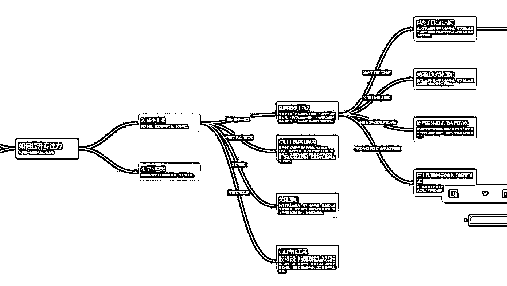

# 使用 AI 以爆炸式的速度集思广益

> 原文：[`www.yuque.com/for_lazy/xkrm14/fobbv5wqis3gsitg`](https://www.yuque.com/for_lazy/xkrm14/fobbv5wqis3gsitg)

<ne-p id="u07a126f0" data-lake-id="u07a126f0"><ne-text id="u72005841">作者： 🐵Sunday🐵</ne-text></ne-p> <ne-p id="u06339cbe" data-lake-id="u06339cbe"><ne-text id="u4cf1bb31">日期：2023-05-02</ne-text></ne-p> <ne-p id="u2a1eae8d" data-lake-id="u2a1eae8d"><ne-text id="u25cb00d2">点赞数：</ne-text><ne-text id="u56954787" ne-bold="true">56</ne-text></ne-p> <ne-hole id="ucf7581cf" data-lake-id="ucf7581cf"><ne-card data-card-name="hr" data-card-type="block" id="STGep" data-event-boundary="card"><ne-p id="u1aa885e5" data-lake-id="u1aa885e5"><ne-text id="u3bf419a9">正文：</ne-text></ne-p> <ne-p id="ub8d81883" data-lake-id="ub8d81883"><ne-text id="ub74595c8">如何使用 AI 以爆炸式的速度集思广益？ 只要输入一个主题进行 Brainstorm，就会生成一张完整的思维导图 该工具称为 ChatGPT-2D：</ne-text> [<ne-text id="u4a3c6abe">ChatGPT-2D:+Use+ChatGPT+on+a+2+Dimensional+Interfa...</ne-text>](http://superusapp.com/chatgpt2d/)</ne-p> <ne-p id="u9255fed2" data-lake-id="u9255fed2"><ne-card data-card-name="image" data-card-type="inline" id="pS20D" data-event-boundary="card"></ne-card></ne-p> <ne-hole id="ub331bb5e" data-lake-id="ub331bb5e"><ne-card data-card-name="hr" data-card-type="block" id="oaMdD" data-event-boundary="card"><ne-p id="u15b121b4" data-lake-id="u15b121b4"><ne-text id="u264236ea">评论区：</ne-text></ne-p> <ne-p id="u4b3bd6d9" data-lake-id="u4b3bd6d9"><ne-text id="u55be498e">水木目 : 刚才小玩了一下，后面要付费了😂</ne-text></ne-p> <ne-hole id="uf131f036" data-lake-id="uf131f036"><ne-card data-card-name="hr" data-card-type="block" id="iQnpQ" data-event-boundary="card"><ne-p id="u40661363" data-lake-id="u40661363"><ne-text id="u13b6010a">公众号懒人找资源，懒人专属群分享</ne-text></ne-p></ne-card></ne-hole></ne-card></ne-hole></ne-card></ne-hole>