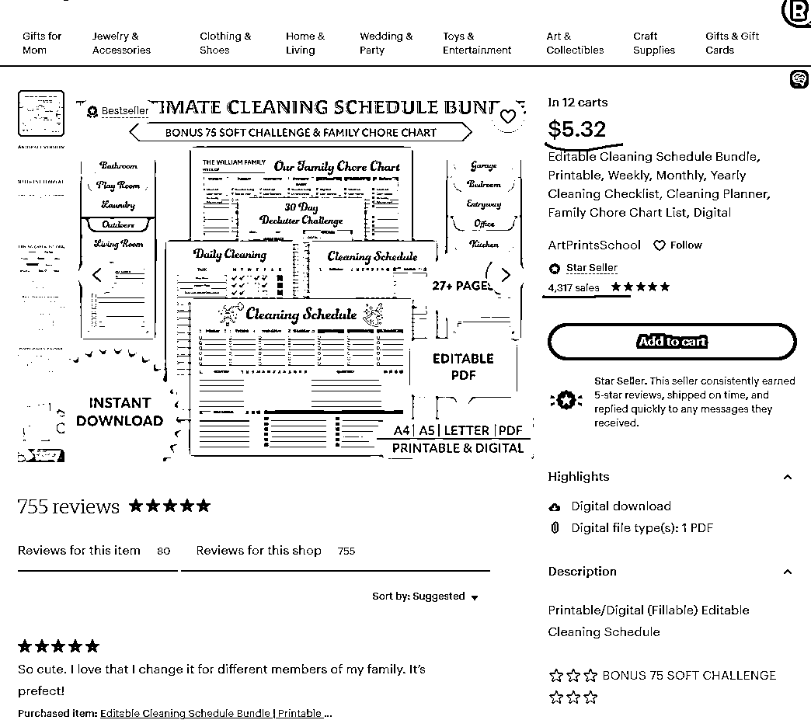
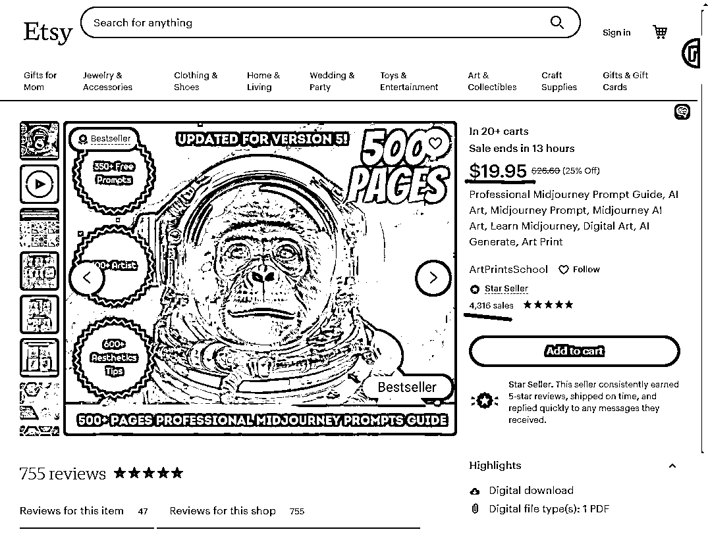

# Etsy 卖虚拟产品

> 原文：[`www.yuque.com/for_lazy/xkrm14/gd20hw7lq3cvaou0`](https://www.yuque.com/for_lazy/xkrm14/gd20hw7lq3cvaou0)

<ne-text id="ua20a90cb">作者： 洪晖</ne-text>

<ne-text id="u585846fb">日期：2023-05-01</ne-text>

<ne-text id="ub8da8398">点赞数：</ne-text><ne-text id="ufcff0c23" ne-bold="true">26</ne-text>

<ne-hole id="u2b9eefa8" data-lake-id="u2b9eefa8"><ne-card data-card-name="hr" data-card-type="block" id="mhatv" data-event-boundary="card">

<ne-text id="u97723946">正文：</ne-text>

<ne-text id="uc1440665">#风向标# Etsy 卖虚拟产品，比如：Midjourney Prompt Guide，19.95 美元，销售量 4316</ne-text>

<ne-card data-card-name="image" data-card-type="inline" id="fqELI" data-event-boundary="card"></ne-card>

<ne-card data-card-name="image" data-card-type="inline" id="ouhUD" data-event-boundary="card"></ne-card>

<ne-hole id="u61e69fc3" data-lake-id="u61e69fc3"><ne-card data-card-name="hr" data-card-type="block" id="foVva" data-event-boundary="card">

<ne-text id="u9f22cb06">评论区：</ne-text>

<ne-text id="ueb84c785">绮丽 : 风向标是咋玩啊？打卡参与？</ne-text>

<ne-hole id="u96beaec7" data-lake-id="u96beaec7"><ne-card data-card-name="hr" data-card-type="block" id="pbSuL" data-event-boundary="card">

<ne-text id="ud00c8cde">公众号懒人找资源，懒人专属群分享</ne-text>

</ne-card></ne-hole></ne-card></ne-hole></ne-card></ne-hole>