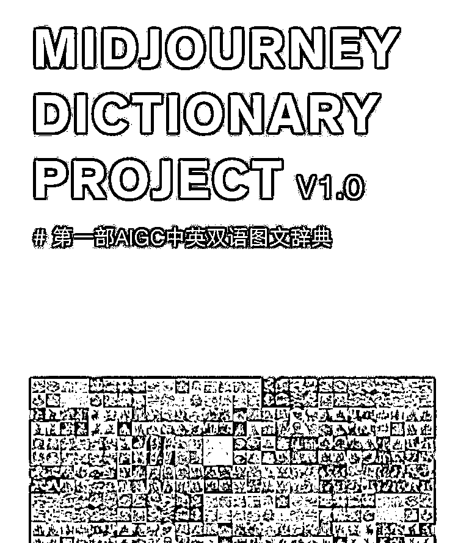

# Midjourney 提示词中英双语图文辞典

> 原文：[`www.yuque.com/for_lazy/xkrm14/gtddsbwkc8e8hxm2`](https://www.yuque.com/for_lazy/xkrm14/gtddsbwkc8e8hxm2)

作者： tony

日期：2023-05-01

点赞数：62

<ne-hole id="ua72d0953" data-lake-id="ua72d0953">

正文：

Midjourney 提示词中英双语图文辞典，应该是目前最全的

  <ne-hole id="u29007ac8" data-lake-id="u29007ac8"><ne-p id="u3716001b" data-lake-id="u3716001b">评论区：

短视频 I 直播 I : 感谢🙏

合一 : 感谢，毫不夸张的说，这个直接可以上架出售

tony : [嘿哈][嘿哈]

小时候可逗了 : 非常感谢[强]

<ne-hole id="ucefa8c92" data-lake-id="ucefa8c92">

公众号懒人找资源，懒人专属群分享

</ne-hole></ne-hole></ne-p></ne-hole>