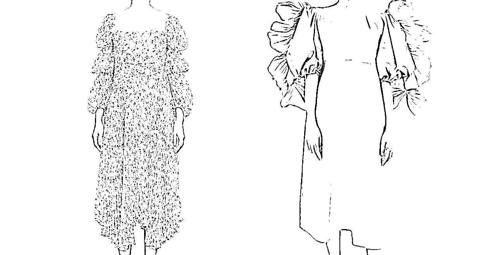

# ChatGPT 大浪潮下，AIGC 已经开始改造时尚行业了

> 原文：[`www.yuque.com/for_lazy/xkrm14/mu9pe2nav0p9g7hi`](https://www.yuque.com/for_lazy/xkrm14/mu9pe2nav0p9g7hi)

<ne-text id="u17411296">作者： 🐵Sunday🐵</ne-text>

<ne-text id="u9b86ef53">日期：2023-04-30</ne-text>

<ne-text id="ube2a19bf">点赞数：</ne-text><ne-text id="ufcbe368f" ne-bold="true">22</ne-text>

<ne-hole id="u9d63b828" data-lake-id="u9d63b828"><ne-card data-card-name="hr" data-card-type="block" id="kCe6p" data-event-boundary="card">

<ne-text id="u69325c4c">正文：</ne-text>

<ne-text id="ueccd9b80">ChatGPT 大浪潮下，AIGC 已经开始改造时尚行业了 什么样的企业可以让时尚行业 AIGC</ne-text> <ne-text id="uecf94960">落地？从实现层面上来说，服务时尚数字化的头部企业，具有专业的场景理解，良好的数据底层，持续的模型研发能力，就具备让时尚行业 AIGC</ne-text> <ne-text id="ued476a45">落地的能力。我们手头上看到一家国内头部专注于服装行业数字化，并且刚刚发布了基于 AIGC 应用的企业 —— 凌迪</ne-text> <ne-text id="ue52fc806">Style3D。从官方资料看，Style3D 是全球头部的专注于服务服装行业的 3D</ne-text> <ne-text id="u114cb6ee">数字化解决方案提供商。是一家服务服装行业全链条，包括面料商、辅料商、设计生产商，到品牌商数字化的企业，目前已经积累了大量的结构化数据。AIGC</ne-text> <ne-text id="u85ad200b">的涌现能力强依赖于大量结构化的数据支撑，当前市面上的 AI</ne-text> <ne-text id="u2163541f">模型虽然能够实现多场景多领域的应用效果，但对于垂直的时尚行业并不是最优方案。究其原因，一方面是数据专业性，一方面是模型收敛域。 原文直达：</ne-text> [<ne-text id="ufa03ac5f">ChatGPT 大浪潮下，AIGC 已经开始改造时尚行业了</ne-text>](https://mp.weixin.qq.com/s/SmKQLFqg6PL69KrdIypVCw)

<ne-card data-card-name="image" data-card-type="inline" id="vBtit" data-event-boundary="card">  <ne-p id="u81d2ee2e" data-lake-id="u81d2ee2e"><ne-card data-card-name="image" data-card-type="inline" id="ck3zS" data-event-boundary="card">  <ne-hole id="u538578fc" data-lake-id="u538578fc"><ne-card data-card-name="hr" data-card-type="block" id="HR9Qg" data-event-boundary="card"><ne-p id="u4e861262" data-lake-id="u4e861262"><ne-text id="u78477077">评论区：</ne-text>

<ne-hole id="u5290476f" data-lake-id="u5290476f"><ne-card data-card-name="hr" data-card-type="block" id="gv6fx" data-event-boundary="card">

<ne-text id="ud33bbe19">公众号懒人找资源，懒人专属群分享</ne-text>

</ne-card></ne-hole></ne-card></ne-hole></ne-card></ne-p></ne-card></ne-p></ne-card></ne-hole>