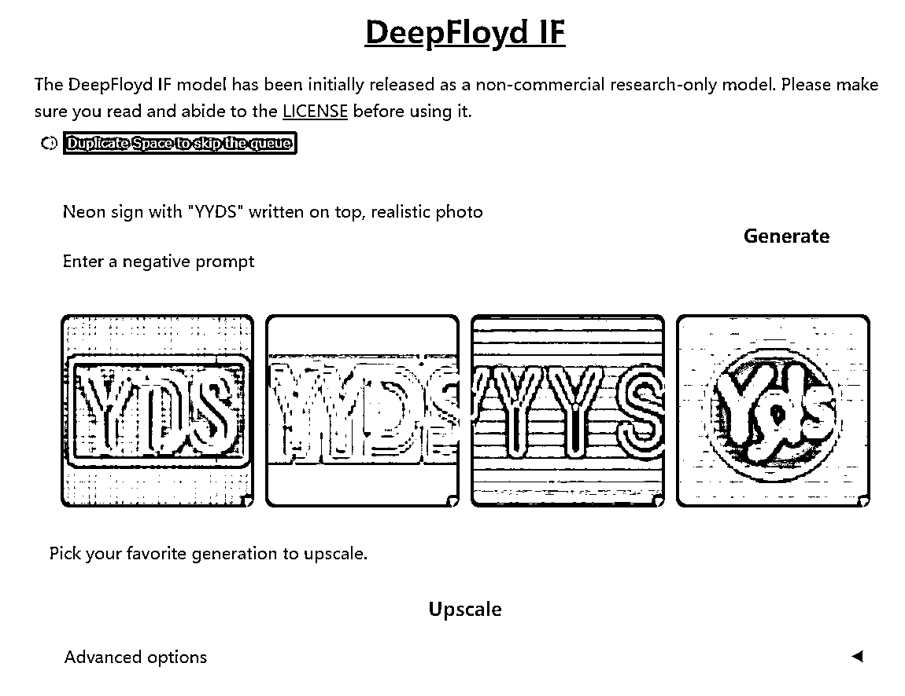
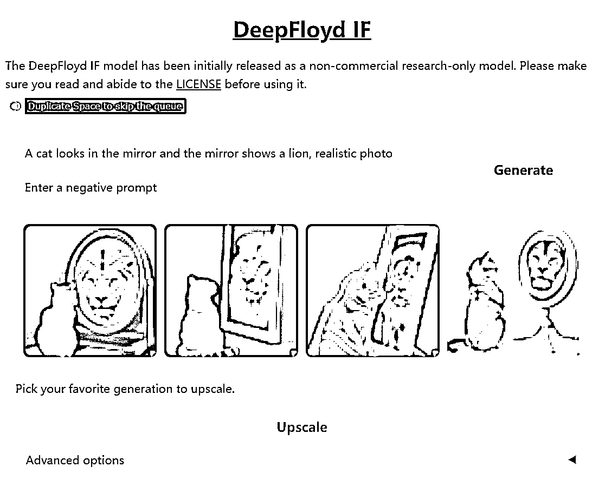
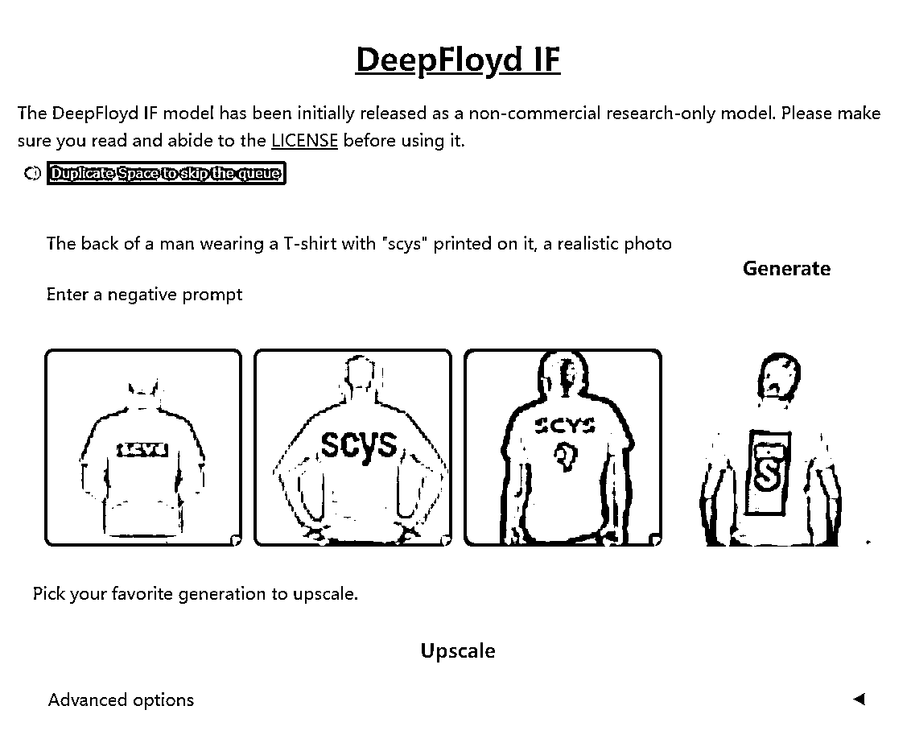

# StabilityAI 开放新的绘画模型 DeepFloyd IF

> 原文：[`www.yuque.com/for_lazy/xkrm14/gmq4zexoxu2aa4wx`](https://www.yuque.com/for_lazy/xkrm14/gmq4zexoxu2aa4wx)

<ne-p id="u4b0cb432" data-lake-id="u4b0cb432"><ne-text id="u6a322d43">作者： 骄阳</ne-text></ne-p> <ne-p id="u48eaf9c1" data-lake-id="u48eaf9c1"><ne-text id="u5d7168bc">日期：2023-04-29</ne-text></ne-p> <ne-p id="uf2159b4a" data-lake-id="uf2159b4a"><ne-text id="ubd3691f4">点赞数：</ne-text><ne-text id="uff34a421" ne-bold="true">56</ne-text></ne-p> <ne-hole id="u73ab4e79" data-lake-id="u73ab4e79"><ne-card data-card-name="hr" data-card-type="block" id="N2a7i" data-event-boundary="card"><ne-p id="uf7745986" data-lake-id="uf7745986"><ne-text id="u5414ed98">正文：</ne-text></ne-p> <ne-p id="u9545f06e" data-lake-id="u9545f06e"><ne-text id="u979bf978">Stable Diffusion 背后公司 StabilityAI 放出大招，开放新的绘画模型 DeepFloyd IF，可以直出 AI 海报，实现像素级图像生成。</ne-text> <ne-text id="ucbb86227">1、该模型可以准确绘制文字，图 1，霓虹灯上面写着 "YYDS "的牌子，现实主义照片（Neon sign with "YYDS" written on</ne-text> <ne-text id="u30ba91d8">top, realistic photo） 2、该模型准确理解空间关系，图 2，一只猫照镜子，镜子里是一只狮子，逼真的照片（A cat looks in</ne-text> <ne-text id="u6f91cba2">the mirror and the mirror shows a lion, realistic photo）</ne-text> <ne-text id="u7e2c34b3">3、在衣服上写字，图 3，一个男人穿着 T 恤的背影，T 恤上印着“scys”, 现实主义照片（The back of a man wearing a</ne-text> <ne-text id="u143fca5a">T-shirt with "scys" printed on it, a realistic photo） 4、该模型对中文支持不是那么好，图 4</ne-text> <ne-text id="u0e43e48b">DeepFloyd IF 体验地址：</ne-text> [<ne-text id="u425a87fe">IF+-+a+Hugging+Face+Space+by+DeepFloyd</ne-text>](https://huggingface.co/spaces/DeepFloyd/IF)</ne-p> <ne-p id="u09ac3904" data-lake-id="u09ac3904"><ne-card data-card-name="image" data-card-type="inline" id="mPGEE" data-event-boundary="card">  <ne-p id="u431c51a2" data-lake-id="u431c51a2"><ne-card data-card-name="image" data-card-type="inline" id="gcyGx" data-event-boundary="card"></ne-card></ne-p> <ne-p id="u84d0f80d" data-lake-id="u84d0f80d"><ne-card data-card-name="image" data-card-type="inline" id="xt88H" data-event-boundary="card"></ne-card></ne-p> <ne-p id="u44bea72e" data-lake-id="u44bea72e"><ne-card data-card-name="image" data-card-type="inline" id="pmldc" data-event-boundary="card"></ne-card></ne-p> <ne-hole id="u127e5e12" data-lake-id="u127e5e12"><ne-card data-card-name="hr" data-card-type="block" id="RbIqt" data-event-boundary="card"><ne-p id="udfe574f5" data-lake-id="udfe574f5"><ne-text id="u21b87a55">评论区：</ne-text></ne-p> <ne-p id="udebabb5e" data-lake-id="udebabb5e"><ne-text id="u52bfbade">张耑一 : 怎么现在使用？硬件方面需要什么配置</ne-text></ne-p> <ne-p id="u63eb3b9d" data-lake-id="u63eb3b9d"><ne-text id="u3ee54f91">骄阳 : 有在线试用网站，硬件方面参考 sd 的</ne-text></ne-p> <ne-hole id="ue72970c3" data-lake-id="ue72970c3"><ne-card data-card-name="hr" data-card-type="block" id="RomKW" data-event-boundary="card"><ne-p id="ue1044e62" data-lake-id="ue1044e62"><ne-text id="udb788041">公众号懒人找资源，懒人专属群分享</ne-text></ne-p></ne-card></ne-hole></ne-card></ne-hole></ne-card></ne-p></ne-card></ne-hole>