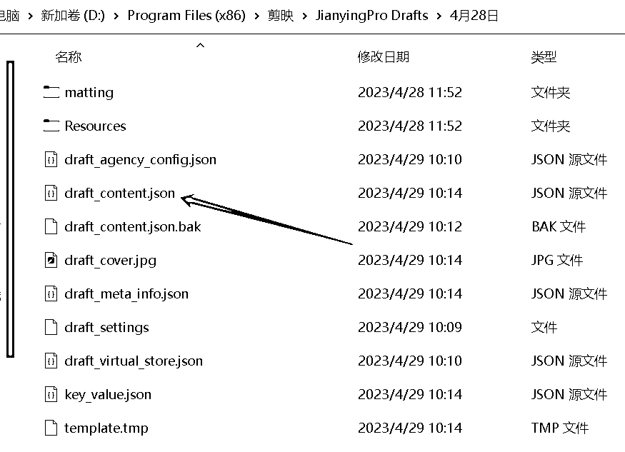
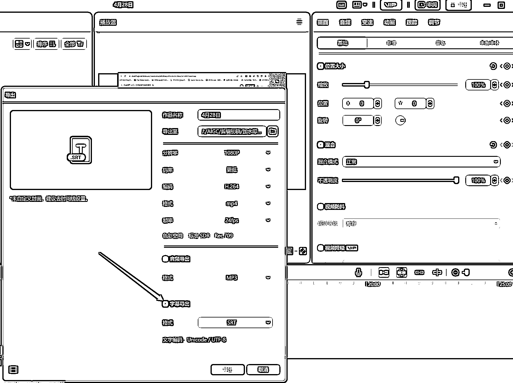
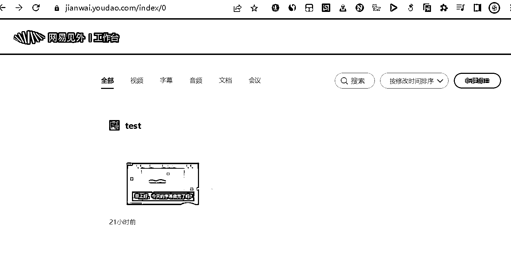

# 吴恩达老师的免费提示词工程课程

> 原文：[`www.yuque.com/for_lazy/xkrm14/hkyr472e0rldee8c`](https://www.yuque.com/for_lazy/xkrm14/hkyr472e0rldee8c)

作者： Fredrich

日期：2023-04-29

点赞数：69

正文：

接上个风向标-吴恩达老师的免费提示词工程课程，如何快速翻译视频字幕，用剪映即可，于是你就可以愉快快速的做国内外视频的搬运工了，have fun： 1、剪映识别字幕（并校正）并提取保存 SRT 字幕文件； 2、网易见外（），免费一键翻译（可以快速校正），可导出双语或者目标语言的 SRT 文件； 3、在剪映的草稿文件夹中找到对应剪辑项目的工程文件 draft_content.json， 合并剪映工程文件和翻译过的 SRT 文件（） 4、替换原视频的工程文件，完成。 参见以下截图[网易见外工作台](https://jianwai.youdao.com/) [剪映字幕在线工具+｜支持剪映字幕文件导入/导出+by+码中人](https://jy.mzh.ren/srt2jy.html)

  

评论区：

AI 同行侠-文卓 : 昨天上午我就是这样把翻译视频做出来的

BLUE : 在 B 站看到的视频，up 主不会是你吧

AI 同行侠-文卓 : 不是我，我没有在 B 站发视频[嘿哈]

田新一 : 我也做了几天了，播放量一般般....

AI 同行侠-文卓 : 会 python 的开发人员 才会持续看，受众群体小了

公众号懒人找资源，懒人专属群分享

</ne-p>