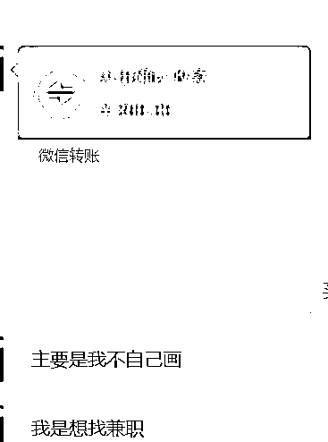
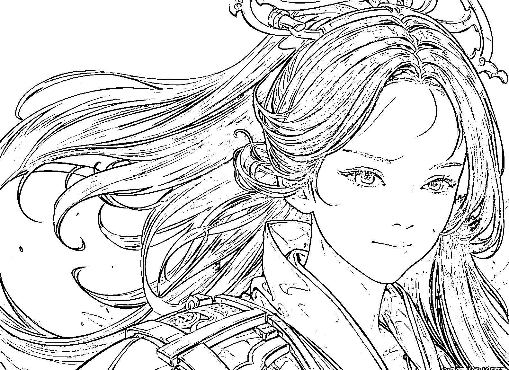

# 给小说配 Ai 图 ，老板要了 500 张+

> 原文：[`www.yuque.com/for_lazy/xkrm14/armgssodbwzcaka0`](https://www.yuque.com/for_lazy/xkrm14/armgssodbwzcaka0)

<ne-text id="uf07ebb7e">作者： 蕃茄</ne-text>

<ne-text id="u13c452e4">日期：2023-04-26</ne-text>

<ne-text id="u770a6c5f">点赞数：</ne-text><ne-text id="u40389225" ne-bold="true">76</ne-text>

<ne-hole id="u40715d14" data-lake-id="u40715d14"><ne-card data-card-name="hr" data-card-type="block" id="LDzpn" data-event-boundary="card">

<ne-text id="u72fb3bf7">正文：</ne-text>

<ne-text id="ue2f587a0">收的 Ai 绘画订金 给小说配 Ai 图 发几张作废的 几块钱不等一张 老板要了 500 张+</ne-text>

<ne-card data-card-name="image" data-card-type="inline" id="n3Wt5" data-event-boundary="card">  <ne-p id="u5c556676" data-lake-id="u5c556676"><ne-card data-card-name="image" data-card-type="inline" id="Hl8gS" data-event-boundary="card">  <ne-p id="u773e91b4" data-lake-id="u773e91b4"><ne-card data-card-name="image" data-card-type="inline" id="n5wvT" data-event-boundary="card">  <ne-p id="uca2450c5" data-lake-id="uca2450c5"><ne-card data-card-name="image" data-card-type="inline" id="oUl2G" data-event-boundary="card"></ne-card>

<ne-card data-card-name="image" data-card-type="inline" id="E5aNb" data-event-boundary="card"></ne-card>

<ne-card data-card-name="image" data-card-type="inline" id="IJoHi" data-event-boundary="card"></ne-card>

<ne-card data-card-name="image" data-card-type="inline" id="dY2Bf" data-event-boundary="card"></ne-card>

<ne-card data-card-name="image" data-card-type="inline" id="wAoLP" data-event-boundary="card"></ne-card>

<ne-card data-card-name="image" data-card-type="inline" id="mc0fu" data-event-boundary="card"></ne-card>

<ne-hole id="u2fc46fcd" data-lake-id="u2fc46fcd"><ne-card data-card-name="hr" data-card-type="block" id="v5Uol" data-event-boundary="card">

<ne-text id="u1c539fa1">评论区：</ne-text>

<ne-text id="u4b68d9b2">红日 : 你这是用哪个 AI 画的？ 关键词怎么配置的，能学习一下吗</ne-text>

<ne-text id="u57d201e1">蕃茄 : stable diffusion 商用的 参数比较多 你留个微信 我加你发给你</ne-text>

<ne-text id="ubaff3bba">亿白—深圳—终身学习 : 我也想要可以吗 v:hwh050108</ne-text>

<ne-text id="ua6dac0e4">金九渊 : 怎么找到这种老板呢？</ne-text>

<ne-text id="ua4a89a66">蕃茄 : 老板自己找的我</ne-text>

<ne-text id="ucc821b99">liong : 求参数 这几天再研究 sd 谢谢。我的号：invquant</ne-text>

<ne-text id="u53a18abb">梦忘忧 : 我也想要 stable diffusion 商用的 参数，能发下吗？</ne-text>

<ne-hole id="u282c6d6d" data-lake-id="u282c6d6d"><ne-card data-card-name="hr" data-card-type="block" id="MvJkM" data-event-boundary="card">

<ne-text id="ue40c4c21">公众号懒人找资源，懒人专属群分享</ne-text>

</ne-card></ne-hole></ne-card></ne-hole></ne-card></ne-p></ne-card></ne-p></ne-card></ne-p></ne-card></ne-hole>