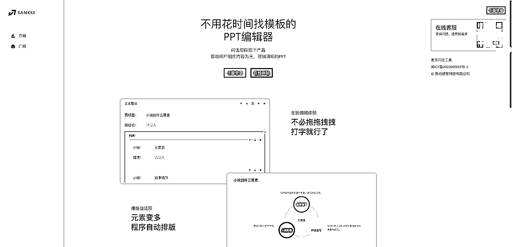

# 一键生成 PPT 到底哪家强？给大家总结了三种目前体验最好的方法

> 原文：[`www.yuque.com/for_lazy/xkrm14/wzpgqxzdpzoa36p3`](https://www.yuque.com/for_lazy/xkrm14/wzpgqxzdpzoa36p3)

<ne-p id="ud76a7701" data-lake-id="ud76a7701"><ne-text id="u7a7e333f">作者： Vergil</ne-text></ne-p> <ne-p id="ue6b636d5" data-lake-id="ue6b636d5"><ne-text id="u3231c93b">日期：2023-04-25</ne-text></ne-p> <ne-p id="u04c37ca2" data-lake-id="u04c37ca2"><ne-text id="u666a072f">点赞数：</ne-text><ne-text id="u105dbcff" ne-bold="true">52</ne-text></ne-p> <ne-hole id="ua3c19ad4" data-lake-id="ua3c19ad4"><ne-card data-card-name="hr" data-card-type="block" id="RL7Pn" data-event-boundary="card"><ne-p id="uc5cf3cf3" data-lake-id="uc5cf3cf3"><ne-text id="u02e86bfe">正文：</ne-text></ne-p> <ne-p id="u3e6f15e9" data-lake-id="u3e6f15e9"><ne-text id="ue0187af1">一键生成 PPT 到底哪家强？ 经过这段时间的摸索和体验，给大家总结了三种目前体验最好的方法，各有利弊： 1、M‍‍otion Go</ne-text> <ne-text id="u790acada">点评：整体体验上，还是比较方便的，几乎没有门槛，虽然说输出成品水平一般，但是时间紧急的话也够用。 02、Gamma</ne-text> <ne-text id="uab1df722">点评：模板质量高，生成速度快，不需要安装就能直接使用，无需付费（可能是暂时），调整版式布局比较方便，支持对话式修改，不过需要有一定的英文基础（也可以借助翻译），文件导出暂不支持 PPT 文件，需要额外使用 PDF 转码器进行转码。</ne-text> <ne-text id="uedda1768">3、闪击 PPT 点评：总体来说，闪击 PPT 的使用是需要一定的门槛，主要依托 ChatGPT 的内容扩写</ne-text> <ne-text id="u82850172">只有内容上和 AI 相关，其余修改仍然需要手动，中间模块化的设置自定义程度高，本身内置的模板质量比较简约，风格相对单一，目前导出可编辑文件需要付费。</ne-text> <ne-text id="u582ece3e">总结：三者对比之后，体验感最好的是 Motion Go，模板质量最高的是 Gamma，制作效率最快的是闪击 PPT。大家可以根据自己的实际需求使用。</ne-text> [<ne-text id="u93b14756">MotionGo 官网</ne-text><ne-text id="u8039c563" ne-italic="true">原 PPT 动画插件口袋动画</ne-text><ne-text id="udf877ada">免费商用 PPT 插件</ne-text>](http://motion.yoo-ai.com/) [<ne-text id="u2d21132a">Gamma+App</ne-text>](https://gamma.app/) [<ne-text id="u07ad5234">闪击 PPT+-+高效内容演示</ne-text>](https://ppt.sankki.com/)</ne-p> <ne-p id="u8d25bd8f" data-lake-id="u8d25bd8f"><ne-card data-card-name="image" data-card-type="inline" id="iTJeS" data-event-boundary="card"></ne-card></ne-p> <ne-p id="u8b93843b" data-lake-id="u8b93843b"><ne-card data-card-name="image" data-card-type="inline" id="CPA7i" data-event-boundary="card"></ne-card></ne-p> <ne-p id="uf51fc3ff" data-lake-id="uf51fc3ff"><ne-card data-card-name="image" data-card-type="inline" id="Ts977" data-event-boundary="card"></ne-card></ne-p> <ne-hole id="u86a323d3" data-lake-id="u86a323d3"><ne-card data-card-name="hr" data-card-type="block" id="IDwLD" data-event-boundary="card"><ne-p id="ue90eaaae" data-lake-id="ue90eaaae"><ne-text id="u4e95053f">评论区：</ne-text></ne-p> <ne-p id="uad3128e5" data-lake-id="uad3128e5"><ne-text id="uf9712a1f">老彭 : 好用吗，我先把我写的文章，一键转成 PPT，给团队开会</ne-text></ne-p> <ne-p id="uff8afd05" data-lake-id="uff8afd05"><ne-text id="u451a2627">Vergil : 推荐 MOTION GO</ne-text></ne-p> <ne-p id="uaa9f1ccb" data-lake-id="uaa9f1ccb"><ne-text id="u9f735c23">伊晨 : 感谢分享</ne-text></ne-p> <ne-hole id="u49a40dfa" data-lake-id="u49a40dfa"><ne-card data-card-name="hr" data-card-type="block" id="lneLt" data-event-boundary="card"><ne-p id="ub7ddff6d" data-lake-id="ub7ddff6d"><ne-text id="u5e095a8a">公众号懒人找资源，懒人专属群分享</ne-text></ne-p></ne-card></ne-hole></ne-card></ne-hole></ne-card></ne-hole>