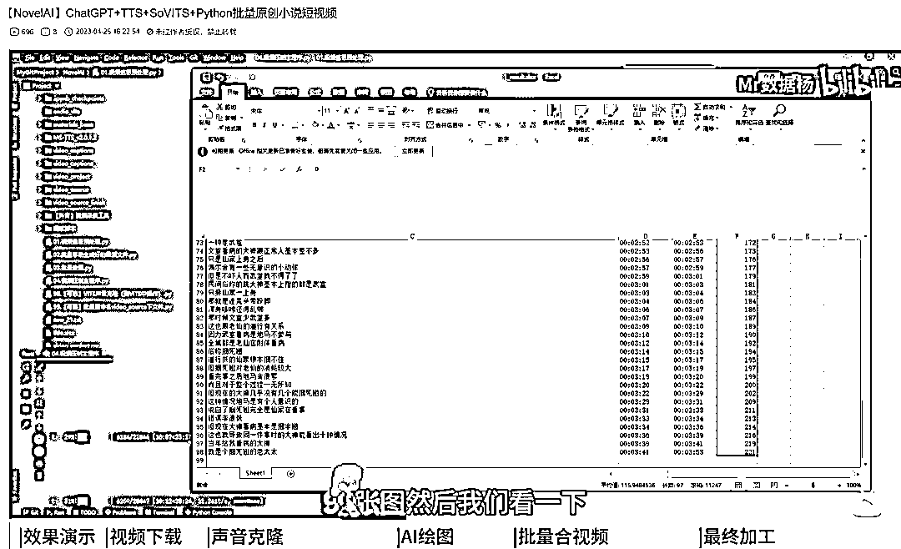

# ChatGPT+TTS+SoVITS+Python，批量原创小说短视频

> 原文：[`www.yuque.com/for_lazy/xkrm14/pqbsryf8a75ym4s5`](https://www.yuque.com/for_lazy/xkrm14/pqbsryf8a75ym4s5)

<ne-text id="ufa868285">作者： At</ne-text>

<ne-text id="uf36dacc2">日期：2023-04-25</ne-text>

<ne-text id="ua4f075e5">点赞数：</ne-text><ne-text id="u5788abbd" ne-bold="true">38</ne-text>

<ne-hole id="ud7a4f7f3" data-lake-id="ud7a4f7f3"><ne-card data-card-name="hr" data-card-type="block" id="HHWDb" data-event-boundary="card">

<ne-text id="uddb1fde4">正文：</ne-text>

<ne-text id="u9f82cea5">ChatGPT+TTS+SoVITS+Python 批量原创小说短视频</ne-text>

<ne-card data-card-name="image" data-card-type="inline" id="rGQqR" data-event-boundary="card"></ne-card>

<ne-hole id="u4ffa465f" data-lake-id="u4ffa465f"><ne-card data-card-name="hr" data-card-type="block" id="mpvui" data-event-boundary="card">

<ne-text id="u7e0961e9">评论区：</ne-text>

<ne-text id="u973985c5">狗头 : 有成品吗？看看</ne-text>

<ne-text id="u4b91a14e">At : 我没有，B 站博主有</ne-text>

<ne-text id="uff22c8de">闲米 : 求一下视频链接</ne-text>

<ne-text id="uaa28d1f4">北冥有鱼 : 【NovelAI】ChatGPT+TTS+SoVITS+Python 批量原创小说短视频</ne-text><ne-text id="uf7ac440d" ne-italic="true">哔哩哔哩</ne-text><ne-text id="uc3db4c08">b...</ne-text> <ne-text id="u3569b703"><ne-text id="ue2ff97ac">card.all.click&vd_source=982ea08033d746b08507979858828b09)</ne-text>

<ne-text id="u2b93cf8e">闲米 : 感谢</ne-text>

<ne-text id="u2f919fa7">短视频 I 直播 I : 怎么玩谢谢</ne-text>

<ne-text id="u810a8979">At : 看上面回复的视频</ne-text>

<ne-hole id="u3245875e" data-lake-id="u3245875e"><ne-card data-card-name="hr" data-card-type="block" id="mpld4" data-event-boundary="card">

<ne-text id="uc1aa561e">公众号懒人找资源，懒人专属群分享</ne-text>

</ne-card></ne-hole></ne-card></ne-hole></ne-card></ne-hole>