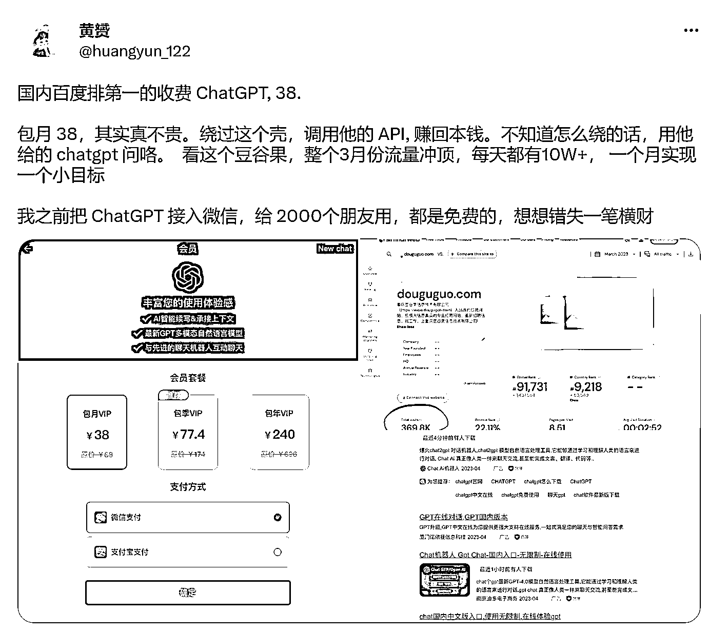
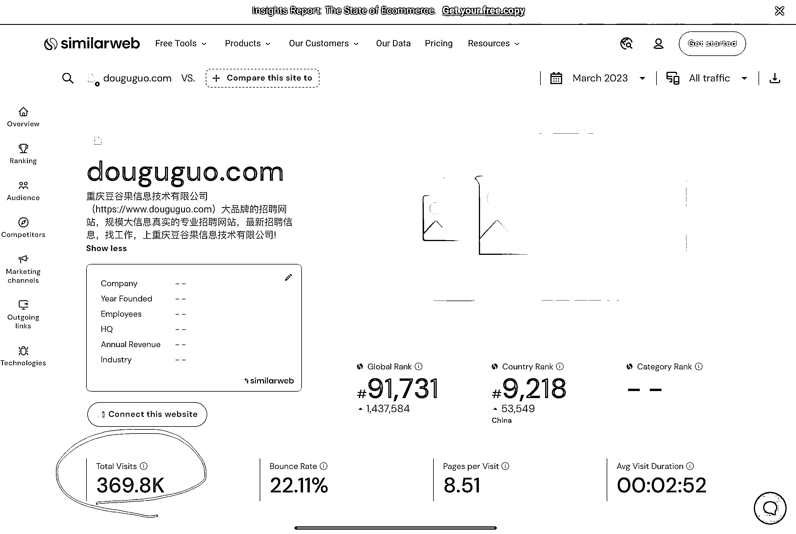

# ChatGPT 国内版，百度竞价投广告，每天 10 万＋流量

> 原文：[`www.yuque.com/for_lazy/xkrm14/xfp3k6qk39yae8u5`](https://www.yuque.com/for_lazy/xkrm14/xfp3k6qk39yae8u5)

作者： 修心阿

日期：2023-04-25

点赞数：37

<ne-hole id="u3ef8b40a" data-lake-id="u3ef8b40a"><ne-card data-card-name="hr" data-card-type="block" id="mQLgs" data-event-boundary="card">

正文：

chatgpt 国内版百度竞价投广告每天 10 万＋流量。赚多少自己算咯 Chatgpt 百度竞价 刚刚看了眼推这赚钱风向标不就来了吗，好多年不用百度浏览器。也错失了发现赚钱的各种可能性。 大家现在都不爱用百度，资深互联网人很多都不用有各类竞价广告，但同时也看不到相应赚钱机会 最好的赚钱案例就在百度搜索竞价广告首页呀，挨个看一遍就知道这个市场多大需求多猛多赚钱啦。 没想到 chatgpt 的需求这么大，尤其是不会各种操作的伙伴，对普通人来说有较高门槛但也想用阿 这个时候国内套壳 chatgpt 的机会就来了。看这个网站的日流量每天 10 万＋包月 38 利润无法想象 通过这个案例打开思路了，很多时候会什么就忽视什么，中国 14 亿人你会的大多数人都不会很正常 这就是赚钱的机会，百度竞价这一块，赚不赚钱看有多少投广告的，再用同类工具查询一目了然

<ne-card data-card-name="image" data-card-type="inline" id="ndBLj" data-event-boundary="card"></ne-card>

<ne-card data-card-name="image" data-card-type="inline" id="EZTAr" data-event-boundary="card"></ne-card>

<ne-card data-card-name="image" data-card-type="inline" id="fagpV" data-event-boundary="card"></ne-card>

<ne-card data-card-name="image" data-card-type="inline" id="mbgRq" data-event-boundary="card"></ne-card>

<ne-hole id="u24a7ac61" data-lake-id="u24a7ac61"><ne-card data-card-name="hr" data-card-type="block" id="vQYxR" data-event-boundary="card">

评论区：

范 Tel 青年 : 这样做没法律风险吗？

修心阿 : 套壳很正常，在国内也不用魔法。违什么法

范 Tel 青年 : 数据外流

姬小光 : 访问 chatgpt 就是违法，更别说套壳，运营商申请海外专线都明确封禁 chatgpt

修心阿 : 您说的对

<ne-hole id="u5e7863f1" data-lake-id="u5e7863f1"><ne-card data-card-name="hr" data-card-type="block" id="pW0IW" data-event-boundary="card">

公众号懒人找资源，懒人专属群分享

</ne-card></ne-hole></ne-card></ne-hole></ne-card></ne-hole>