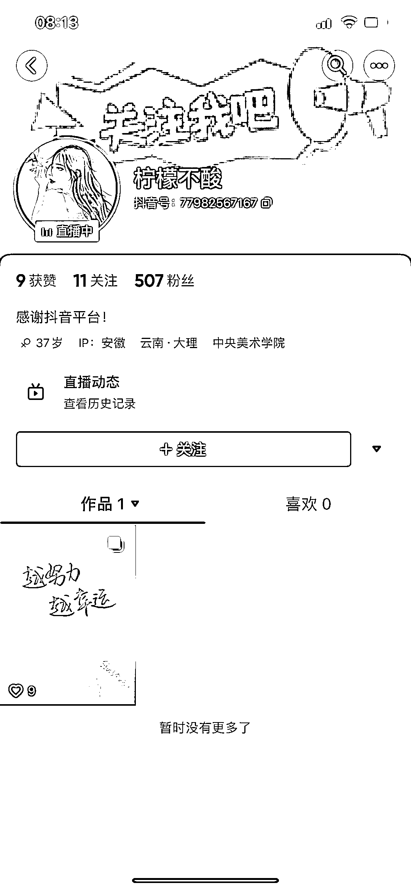

# 巧用 ChatGPT 起名，父姓 + 母姓 = 宝宝名字

> 原文：[`www.yuque.com/for_lazy/xkrm14/kruuobntalvsqlo8`](https://www.yuque.com/for_lazy/xkrm14/kruuobntalvsqlo8)

<ne-text id="ube0bf470">作者： 饭饭</ne-text>

<ne-text id="u6df9253b">日期：2023-04-24</ne-text>

<ne-text id="u373c9555">点赞数：</ne-text><ne-text id="u9eaeae87" ne-bold="true">136</ne-text>

<ne-hole id="u1bb2a300" data-lake-id="u1bb2a300"><ne-card data-card-name="hr" data-card-type="block" id="mhXVq" data-event-boundary="card">

<ne-text id="u69d1dad0">正文：</ne-text>

<ne-text id="u0a893ba4">巧用 chatGPT 起名 父姓+母姓=宝宝名字 这个格式涨粉快，流量大、礼物多</ne-text>

<ne-card data-card-name="image" data-card-type="inline" id="J5i4K" data-event-boundary="card">  <ne-p id="u28551491" data-lake-id="u28551491"><ne-card data-card-name="image" data-card-type="inline" id="EmYwt" data-event-boundary="card">  <ne-hole id="uc3094db9" data-lake-id="uc3094db9"><ne-card data-card-name="hr" data-card-type="block" id="VvkEi" data-event-boundary="card"><ne-p id="u7a382d5d" data-lake-id="u7a382d5d"><ne-text id="u4f494c51">评论区：</ne-text>

<ne-text id="u13c5cc0f">坏脾气的小可爱 : 🐮呀，饭饭</ne-text>

<ne-text id="u2ce085d0">灰青 : 我马上去冲冲看[呲牙][呲牙][呲牙]谢谢大佬</ne-text>

<ne-text id="ud94bf4cf">生真大师 : 这个怎么训练的？</ne-text>

<ne-text id="u7c1ecd6a">认知小窗-认哥 : 传统经典文学，加上美好寓意</ne-text>

<ne-text id="ue2c11fe9">艾琳 : 聪明人太多</ne-text>

<ne-text id="u6f917bb3">饭饭 : [爱心]谢谢亦仁哥</ne-text>

<ne-text id="ue4189847">饭饭 : [玫瑰]一起探索</ne-text>

<ne-hole id="ufb7d4d19" data-lake-id="ufb7d4d19"><ne-card data-card-name="hr" data-card-type="block" id="s1zgE" data-event-boundary="card">

<ne-text id="u1ae06793">公众号懒人找资源，懒人专属群分享</ne-text>

</ne-card></ne-hole></ne-card></ne-hole></ne-card></ne-p></ne-card></ne-p></ne-card></ne-hole>