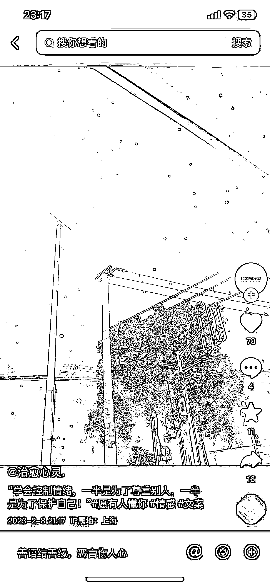
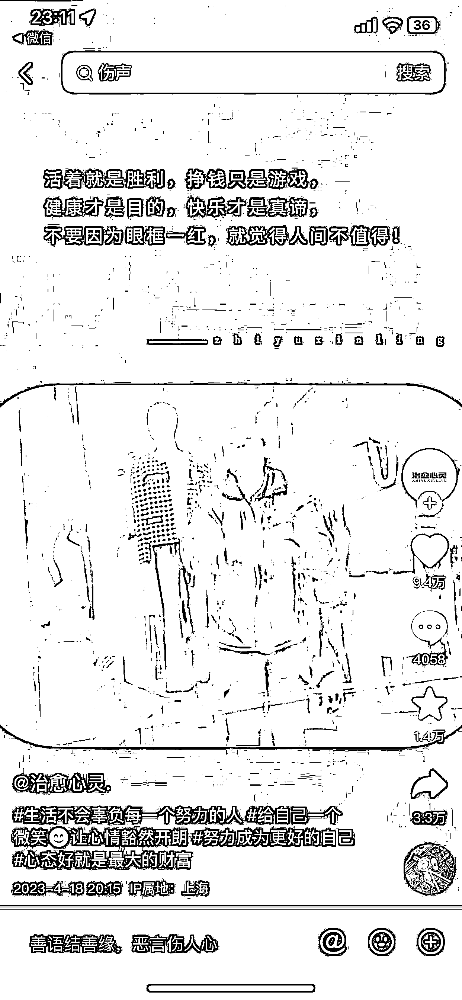

# 抖音文案类账号更新模板后点赞数据提升明显

> 原文：[`www.yuque.com/for_lazy/xkrm14/xym53b5mvkikmpg9`](https://www.yuque.com/for_lazy/xkrm14/xym53b5mvkikmpg9)

作者： 发强

日期：2023-05-03

点赞数：21

正文：

抖音文案类账号 截止二月份更新（图一）， 点赞数据基本不破百， 内容模板就是图片加一些特效，（图三） 停更两个月后，四月份又开启日更（图二）。 点赞数据提升明显 更新模板为：文案内容+欢快舞动的人物视频， 背景音乐一直用的同一个，给人以轻松愉悦的感觉。 模板更直观的展示了描述的文案内容， 也通过视频加上背景音乐，让人心情放松。

评论区：

公众号懒人找资源，懒人专属群分享

