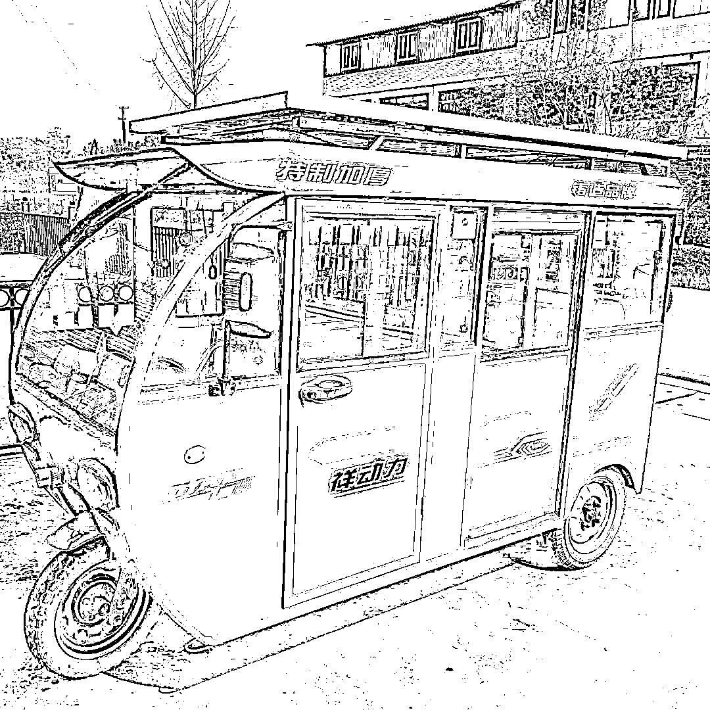
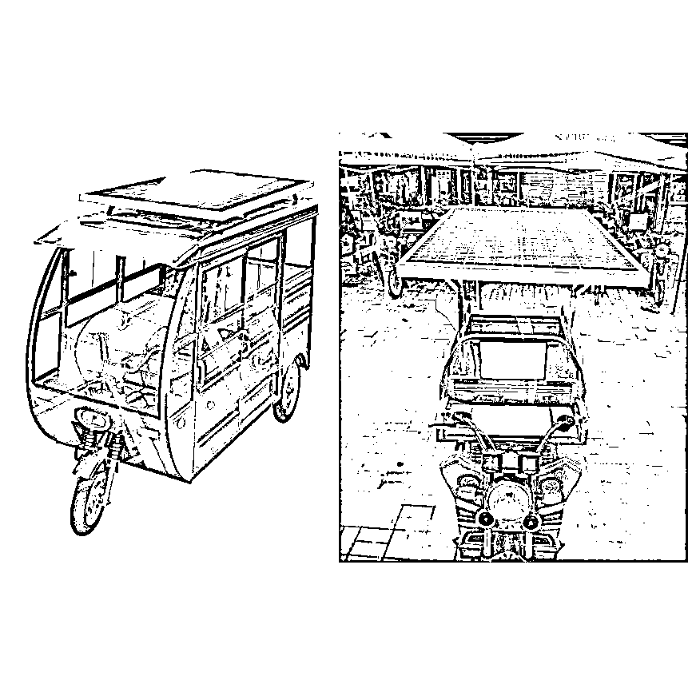
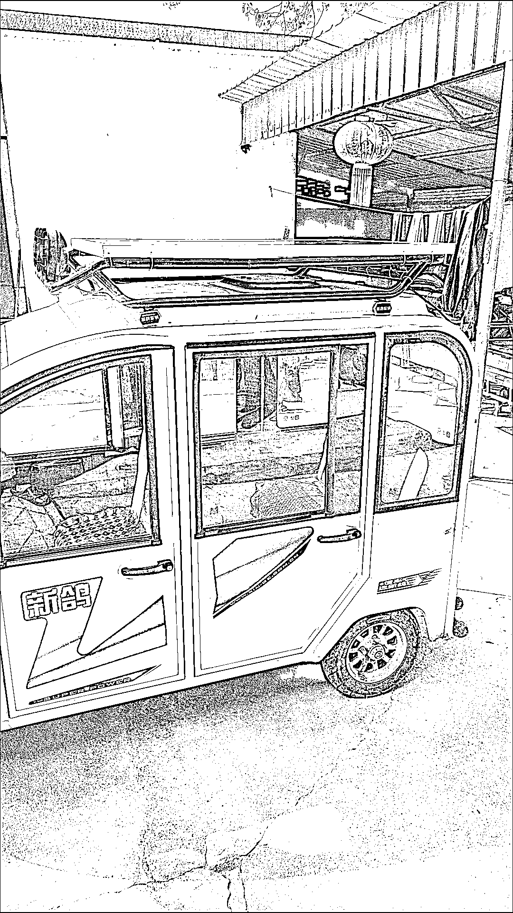

# 电动三四轮车顶太阳能充电板，可以通过视频号、抖音引流

> 原文：[`www.yuque.com/for_lazy/xkrm14/bbuqrxifwpfyq7zg`](https://www.yuque.com/for_lazy/xkrm14/bbuqrxifwpfyq7zg)

<ne-p id="ua2e5a13d" data-lake-id="ua2e5a13d"><ne-text id="u4e810a94">作者： 二虎</ne-text></ne-p> <ne-p id="u8285f062" data-lake-id="u8285f062"><ne-text id="ue9d0fa3b">日期：2023-05-02</ne-text></ne-p> <ne-p id="ub1b569c7" data-lake-id="ub1b569c7"><ne-text id="u5ea236b4">点赞数：</ne-text><ne-text id="u59c0d707" ne-bold="true">66</ne-text></ne-p> <ne-hole id="u33f2c368" data-lake-id="u33f2c368"><ne-card data-card-name="hr" data-card-type="block" id="esvVO" data-event-boundary="card"><ne-p id="uf48e904a" data-lake-id="uf48e904a"><ne-text id="ub3870680">正文：</ne-text></ne-p> <ne-p id="u63c648e7" data-lake-id="u63c648e7"><ne-text id="ud6bb2208">电动三四轮车顶太阳能充电板</ne-text> <ne-text id="u7c875f99">昨天在老家看到一辆老年代步车上有安装，拼多多搜了一下感觉销量还不低，客户主要是下沉市场的电动三轮车四轮车用户，还有一些送快递的车子也合适。</ne-text> <ne-text id="u5173b428">卖点①自动充电（省钱） ②遮阳隔热 ③不带棚的三轮车安装还可以充当雨棚</ne-text> <ne-text id="u8b204239">我觉得可以通过视频号，抖音或者快手引流，毕竟拼多多和淘宝这种搜索类的网站老年人很多不会用。</ne-text></ne-p> <ne-p id="u402c7029" data-lake-id="u402c7029"><ne-card data-card-name="image" data-card-type="inline" id="HbLRZ" data-event-boundary="card"></ne-card></ne-p> <ne-p id="udfe73bf0" data-lake-id="udfe73bf0"><ne-card data-card-name="image" data-card-type="inline" id="MLW5h" data-event-boundary="card"></ne-card></ne-p> <ne-p id="u21ade539" data-lake-id="u21ade539"><ne-card data-card-name="image" data-card-type="inline" id="aWVU2" data-event-boundary="card"></ne-card></ne-p> <ne-p id="u8b2aee14" data-lake-id="u8b2aee14"><ne-card data-card-name="image" data-card-type="inline" id="pZoe2" data-event-boundary="card"></ne-card></ne-p> <ne-p id="ub8a49570" data-lake-id="ub8a49570"><ne-card data-card-name="image" data-card-type="inline" id="v9uin" data-event-boundary="card"></ne-card></ne-p> <ne-p id="uc705f431" data-lake-id="uc705f431"><ne-card data-card-name="image" data-card-type="inline" id="cQort" data-event-boundary="card"></ne-card></ne-p> <ne-p id="u48606cb4" data-lake-id="u48606cb4"><ne-card data-card-name="image" data-card-type="inline" id="R94Sk" data-event-boundary="card"></ne-card></ne-p> <ne-hole id="u47feea7b" data-lake-id="u47feea7b"><ne-card data-card-name="hr" data-card-type="block" id="omc8I" data-event-boundary="card"><ne-p id="uffadd9be" data-lake-id="uffadd9be"><ne-text id="uf5bd5794">评论区：</ne-text></ne-p> <ne-p id="udc0efc06" data-lake-id="udc0efc06"><ne-text id="u86dbf381">风轻云淡 : 电瓶车是否也可以考虑[呲牙]</ne-text></ne-p> <ne-p id="u66ec1af2" data-lake-id="u66ec1af2"><ne-text id="ubc32c725">二虎 : 电瓶车不好安装吧，没地方装，改棚子的话又不安全</ne-text></ne-p> <ne-p id="ufe64410b" data-lake-id="ufe64410b"><ne-text id="uf337d51b">胡洋 : 得先问过交警叔叔吧，我们这电瓶车凡装棚子立马逮住拆掉</ne-text></ne-p> <ne-hole id="u9c6e63ae" data-lake-id="u9c6e63ae"><ne-card data-card-name="hr" data-card-type="block" id="bW6zG" data-event-boundary="card"><ne-p id="ue703341d" data-lake-id="ue703341d"><ne-text id="u366d1ba9">公众号懒人找资源，懒人专属群分享</ne-text></ne-p></ne-card></ne-hole></ne-card></ne-hole></ne-card></ne-hole>