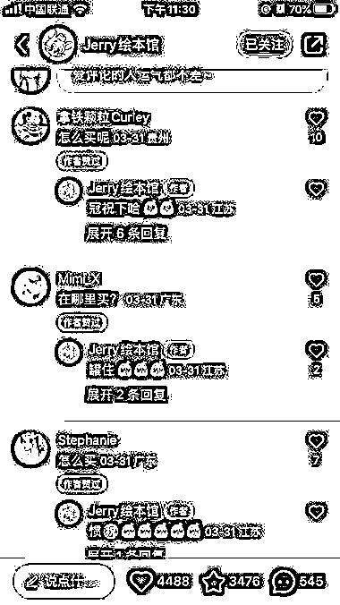
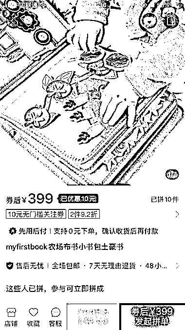
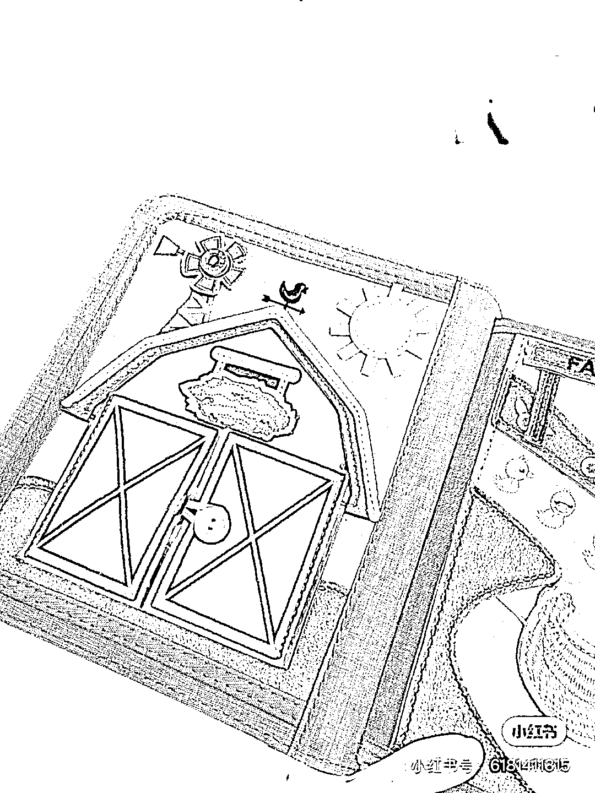

# 抖音低粉的绘本账号，评论区留言引流到微信

> 原文：[`www.yuque.com/for_lazy/xkrm14/gd9aetkmoh7m2ug5`](https://www.yuque.com/for_lazy/xkrm14/gd9aetkmoh7m2ug5)

<ne-p id="u3155c3a0" data-lake-id="u3155c3a0"><ne-text id="u963e006b">作者： cpp112358</ne-text></ne-p> <ne-p id="u6ca16d2e" data-lake-id="u6ca16d2e"><ne-text id="ubc18bb44">日期：2023-04-29</ne-text></ne-p> <ne-p id="uc3cbb850" data-lake-id="uc3cbb850"><ne-text id="u756196ac">点赞数：</ne-text><ne-text id="u19c837ab" ne-bold="true">46</ne-text></ne-p> <ne-hole id="u60de924c" data-lake-id="u60de924c"><ne-card data-card-name="hr" data-card-type="block" id="feJm3" data-event-boundary="card"><ne-p id="u50a9176a" data-lake-id="u50a9176a"><ne-text id="udd97736a">正文：</ne-text></ne-p> <ne-p id="u8a0dc0c2" data-lake-id="u8a0dc0c2"><ne-text id="u5c80bf1b">发现一个低粉的绘本账号，发 3D 儿童绘本，底下一堆问怎么买的，关注后在群聊里发微信引流，加微信的人也不少，十几分钟才通过</ne-text> <ne-text id="ubb44412a">拼多多和京东搜了一下，这套布书 400 左右 加微信后了解到卖的价格是 445</ne-text></ne-p> <ne-p id="u37530289" data-lake-id="u37530289"><ne-card data-card-name="image" data-card-type="inline" id="IXjAh" data-event-boundary="card">  <ne-p id="u11d9bc62" data-lake-id="u11d9bc62"><ne-card data-card-name="image" data-card-type="inline" id="cCFcr" data-event-boundary="card">  <ne-p id="ufac7f63c" data-lake-id="ufac7f63c"><ne-card data-card-name="image" data-card-type="inline" id="OE23p" data-event-boundary="card">  <ne-p id="u815a9367" data-lake-id="u815a9367"><ne-card data-card-name="image" data-card-type="inline" id="vba19" data-event-boundary="card">  <ne-p id="u02a4a48e" data-lake-id="u02a4a48e"><ne-card data-card-name="image" data-card-type="inline" id="Nv08N" data-event-boundary="card">  <ne-p id="u800671c3" data-lake-id="u800671c3"><ne-card data-card-name="image" data-card-type="inline" id="z0B0a" data-event-boundary="card">  <ne-hole id="u81458735" data-lake-id="u81458735"><ne-card data-card-name="hr" data-card-type="block" id="onUDQ" data-event-boundary="card"><ne-p id="u5d3a80fd" data-lake-id="u5d3a80fd"><ne-text id="ub95b6a4f">评论区：</ne-text></ne-p> <ne-p id="u0afb56fe" data-lake-id="u0afb56fe"><ne-text id="u993e21c2">Angie : 买的比三网还贵，客户稍微查一下都会逃走[偷笑]</ne-text></ne-p> <ne-p id="uea54b22b" data-lake-id="uea54b22b"><ne-text id="ua8ca0b64">cpp112358 : 主要是加微信了，就算不买这个，下次还可以买别的，而且不是每个人都会查，都能查到同款</ne-text></ne-p> <ne-p id="u1674b34f" data-lake-id="u1674b34f"><ne-text id="ufe332700">七七姑娘 : 还有一点，有的人心里觉得贵一点品质也好一些，到现在依然有很多人从不在拼多多上买东西，有了对比也许会觉得拼多多也没便宜很多</ne-text></ne-p> <ne-p id="u35476332" data-lake-id="u35476332"><ne-text id="ud2f9b2f4">gaoly : 绘本这个品类真想学习下，我家绘本上花掉了好多钱</ne-text></ne-p> <ne-p id="u3ea6301a" data-lake-id="u3ea6301a"><ne-text id="u2a697a39">重楼 : 绘本这个品类算书籍吗？售卖要不要什么资质？</ne-text></ne-p> <ne-hole id="u342988d2" data-lake-id="u342988d2"><ne-card data-card-name="hr" data-card-type="block" id="B9i9w" data-event-boundary="card"><ne-p id="u602b7775" data-lake-id="u602b7775"><ne-text id="u95be30e4">公众号懒人找资源，懒人专属群分享</ne-text></ne-p></ne-card></ne-hole></ne-card></ne-hole></ne-card></ne-p></ne-card></ne-p></ne-card></ne-p></ne-card></ne-p></ne-card></ne-p></ne-card></ne-p></ne-card></ne-hole>