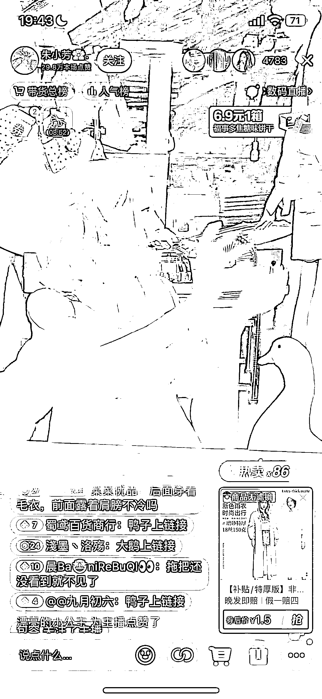

# 抖音直播带货采用疯狂过品的模式，基本一两句话过品，拉停留好厉害

> 原文：[`www.yuque.com/for_lazy/xkrm14/wafgu1knlvodbq5t`](https://www.yuque.com/for_lazy/xkrm14/wafgu1knlvodbq5t)

<ne-p id="u0151fe55" data-lake-id="u0151fe55"><ne-text id="u93be03d9">作者： 行</ne-text></ne-p> <ne-p id="u1e97c861" data-lake-id="u1e97c861"><ne-text id="ucdb3cd11">日期：2023-04-28</ne-text></ne-p> <ne-p id="uad56ee27" data-lake-id="uad56ee27"><ne-text id="u2f43ca75">点赞数：</ne-text><ne-text id="uea7df87d" ne-bold="true">45</ne-text></ne-p> <ne-hole id="u1064c88d" data-lake-id="u1064c88d"><ne-card data-card-name="hr" data-card-type="block" id="Sh6nk" data-event-boundary="card"><ne-p id="u304eaba2" data-lake-id="u304eaba2"><ne-text id="u40fe4f9d">正文：</ne-text></ne-p> <ne-p id="u2f86e9e6" data-lake-id="u2f86e9e6"><ne-text id="u421f1c33">这个账号直播带货采用疯狂过品的模式 基本一两句话过品，拉停留好厉害 最重要的是产品价格很低，给用户一种性价比超高的感觉 商品应该来自精选联盟</ne-text> <ne-text id="ue98810a3">看了一下往期的销售额，最低一天都是上万了 这个方法完全可以套用在视频号上</ne-text></ne-p> <ne-p id="uc0f5f7af" data-lake-id="uc0f5f7af"><ne-card data-card-name="image" data-card-type="inline" id="Q3rRH" data-event-boundary="card"></ne-card></ne-p> <ne-p id="udc933483" data-lake-id="udc933483"><ne-card data-card-name="image" data-card-type="inline" id="ZEyAS" data-event-boundary="card"></ne-card></ne-p> <ne-p id="u22ec4b29" data-lake-id="u22ec4b29"><ne-card data-card-name="image" data-card-type="inline" id="KJZgi" data-event-boundary="card"></ne-card></ne-p> <ne-hole id="u78a8abff" data-lake-id="u78a8abff"><ne-card data-card-name="hr" data-card-type="block" id="DPUp7" data-event-boundary="card"><ne-p id="u8832d9e1" data-lake-id="u8832d9e1"><ne-text id="u1ae44c6c">评论区：</ne-text></ne-p> <ne-p id="u8b56c94d" data-lake-id="u8b56c94d"><ne-text id="udef4ae1d">阿奇 : 这得是和商家谈判后才能有的价格吧，😂</ne-text></ne-p> <ne-p id="u94f4edfb" data-lake-id="u94f4edfb"><ne-text id="u49e67e5a">野草 : 发货特别慢</ne-text></ne-p> <ne-p id="uf1e9b937" data-lake-id="uf1e9b937"><ne-text id="ue67de478">行 : 这个不知道了</ne-text></ne-p> <ne-p id="u9da01e9c" data-lake-id="u9da01e9c"><ne-text id="u64b04efe">行 : 有些商品就是这样的价格</ne-text></ne-p> <ne-p id="u3233975a" data-lake-id="u3233975a"><ne-text id="u4445a71f">梁潆月 : 之前看别人分享说这种一般后面直接不发货的[捂脸]</ne-text></ne-p> <ne-p id="u5601a2ed" data-lake-id="u5601a2ed"><ne-text id="u85158455">金九渊 : 刷到过</ne-text></ne-p> <ne-p id="udd695df9" data-lake-id="udd695df9"><ne-text id="udf864989">昊东.Lee : 有这种，视频号前面关注一个，就是这种形式，低价过品，人气确实高，一周后就不播了，也没法视频作品，也没开橱窗，货发没发更难说，但这个好像能给店铺 sua 销量,懂的退款，不懂的时间长就忘了</ne-text></ne-p> <ne-p id="u4d9ac1fe" data-lake-id="u4d9ac1fe"><ne-text id="u9d1c54e5">作书 : 抖音 1 分购</ne-text></ne-p> <ne-hole id="ud14249d4" data-lake-id="ud14249d4"><ne-card data-card-name="hr" data-card-type="block" id="orP8J" data-event-boundary="card"><ne-p id="ubefeea83" data-lake-id="ubefeea83"><ne-text id="uafbce533">公众号懒人找资源，懒人专属群分享</ne-text></ne-p></ne-card></ne-hole></ne-card></ne-hole></ne-card></ne-hole>