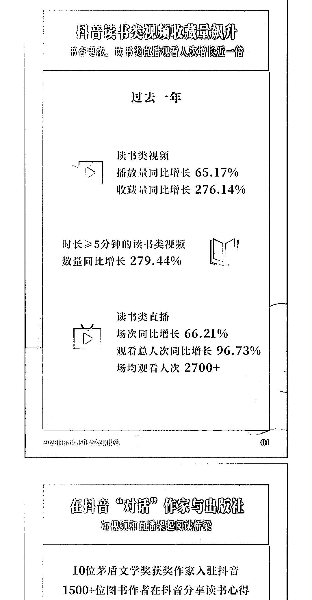

# 抖音读书类视频收藏量飙升

> 原文：[`www.yuque.com/for_lazy/xkrm14/zsy4o4by9abegdmw`](https://www.yuque.com/for_lazy/xkrm14/zsy4o4by9abegdmw)

<ne-text id="u7c31b526">作者： 晓蓉</ne-text>

<ne-text id="uec1059bc">日期：2023-04-27</ne-text>

<ne-text id="ue4a3b13c">点赞数：</ne-text><ne-text id="u1656e17e" ne-bold="true">43</ne-text>

<ne-hole id="u9ee6f773" data-lake-id="u9ee6f773"><ne-card data-card-name="hr" data-card-type="block" id="yk3bu" data-event-boundary="card">

<ne-text id="ub5ec44c3">正文：</ne-text>

<ne-text id="ue0361377">抖音读书类</ne-text>

<ne-card data-card-name="image" data-card-type="inline" id="k6KGd" data-event-boundary="card"></ne-card>

<ne-card data-card-name="image" data-card-type="inline" id="DslFy" data-event-boundary="card">  <ne-hole id="u4f9e54d3" data-lake-id="u4f9e54d3"><ne-card data-card-name="hr" data-card-type="block" id="tTeNm" data-event-boundary="card"><ne-p id="ucbef6f55" data-lake-id="ucbef6f55"><ne-text id="ube8adc20">评论区：</ne-text>

<ne-text id="ub9f32e91">李词宝 : 我的最爱</ne-text>

<ne-text id="u231c6834">晓蓉 : [呲牙][呲牙]那可以好好的深耕一下了</ne-text>

<ne-text id="uf8875680">晓蓉 : 感谢亦仁大大的认可🎉🎉</ne-text>

<ne-hole id="u7401bd95" data-lake-id="u7401bd95"><ne-card data-card-name="hr" data-card-type="block" id="aAa3J" data-event-boundary="card">

<ne-text id="uf0004513">公众号懒人找资源，懒人专属群分享</ne-text>

</ne-card></ne-hole></ne-card></ne-hole></ne-card></ne-p></ne-card></ne-hole>