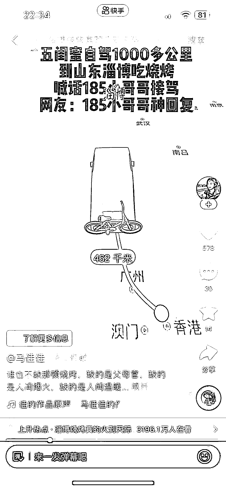
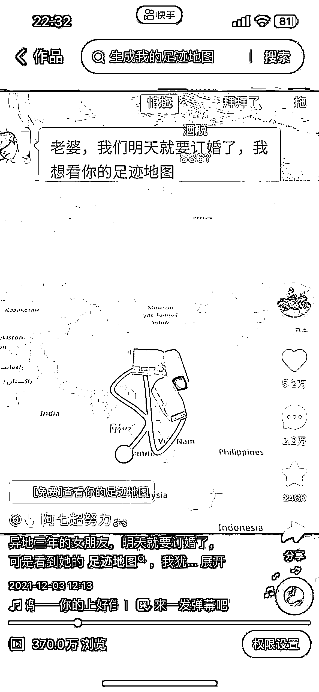

# 抖音带足迹地图的视频，挂生成足迹的小程序，收益很可观

> 原文：[`www.yuque.com/for_lazy/xkrm14/svwa86tk547siln8`](https://www.yuque.com/for_lazy/xkrm14/svwa86tk547siln8)

作者： A 锋华正茂

日期：2023-04-27

点赞数：63

<ne-hole id="u31894885" data-lake-id="u31894885">

正文：

发这种带足迹地图的视频，挂生成足迹的小程序。快手，抖音都可以挂。马上五一放假，在加上淄博烧烤的热度，视频很容易爆，收益也会很可观。最后一个图片是专门生成足迹的软件。

<ne-hole id="u420a4db6" data-lake-id="u420a4db6">

评论区：

抽根烟 : 小程序还能玩？

A 锋华正茂 : 玩肯定是没问题，当主业不太行。

林家少爷 : 很好奇这个是靠卖什么变现的呢，APP？

A 锋华正茂 : 小程序

司马钰 : 可以请问这个具体的操作方法是什么呢？

金康 : 这个有点叼呀

<ne-hole id="ua8763dc6" data-lake-id="ua8763dc6">

公众号懒人找资源，懒人专属群分享

</ne-hole></ne-hole></ne-hole>