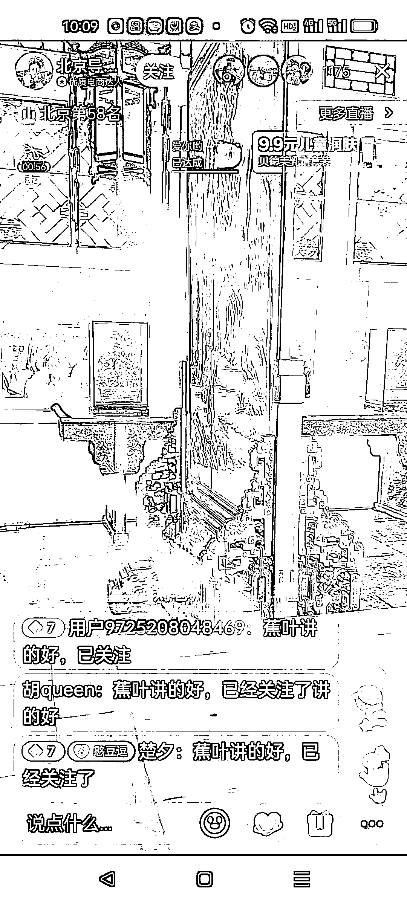

# 抖音旅游卖货形式：导游 + 口播历史故事 + 卖货

> 原文：[`www.yuque.com/for_lazy/xkrm14/dggzdl9qswbx2wyv`](https://www.yuque.com/for_lazy/xkrm14/dggzdl9qswbx2wyv)

<ne-text id="ua5e9c5d0">作者： Mia 米娅</ne-text>

<ne-text id="u90580f19">日期：2023-04-27</ne-text>

<ne-text id="u23da2995">点赞数：</ne-text><ne-text id="u9faf5e54" ne-bold="true">46</ne-text>

<ne-hole id="u771543bc" data-lake-id="u771543bc"><ne-card data-card-name="hr" data-card-type="block" id="LP5eq" data-event-boundary="card">

<ne-text id="u1781b48e">正文：</ne-text>

<ne-text id="u967037f0">导游（正带队正用手机拍摄景点直播）+口播历史故事+卖货 可卖当地的特产也可卖补气血的人参饮品，保健品（导游要一直说话和走动容易累，补气血效果好现身说法）</ne-text> <ne-text id="u41421a9e">碎碎念：我妈（中老年）特别痴迷，相当于云旅游，还能听小故事，挺乐呵。一天下单了好几笔这些导游带的补气血的保健品。我眼前一晕，也不好说啥。</ne-text>

<ne-card data-card-name="image" data-card-type="inline" id="S87qx" data-event-boundary="card">  <ne-p id="ufb934d03" data-lake-id="ufb934d03"><ne-card data-card-name="image" data-card-type="inline" id="oJdGi" data-event-boundary="card">  <ne-hole id="u624ca553" data-lake-id="u624ca553"><ne-card data-card-name="hr" data-card-type="block" id="NsnTX" data-event-boundary="card"><ne-p id="u57a31c10" data-lake-id="u57a31c10"><ne-text id="u9f2fabca">评论区：</ne-text>

<ne-text id="u9a92bbc5">林家少爷 : 女人是消费主力军</ne-text>

<ne-hole id="u31d216ee" data-lake-id="u31d216ee"><ne-card data-card-name="hr" data-card-type="block" id="MUvfb" data-event-boundary="card">

<ne-text id="u05f00b7b">公众号懒人找资源，懒人专属群分享</ne-text>

</ne-card></ne-hole></ne-card></ne-hole></ne-card></ne-p></ne-card></ne-p></ne-card></ne-hole>