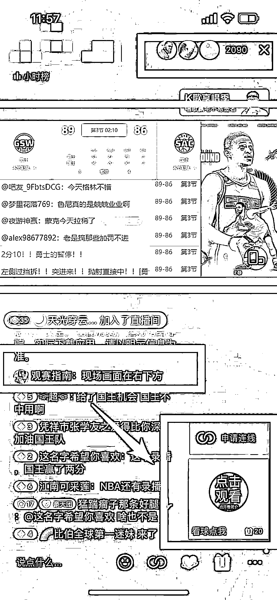
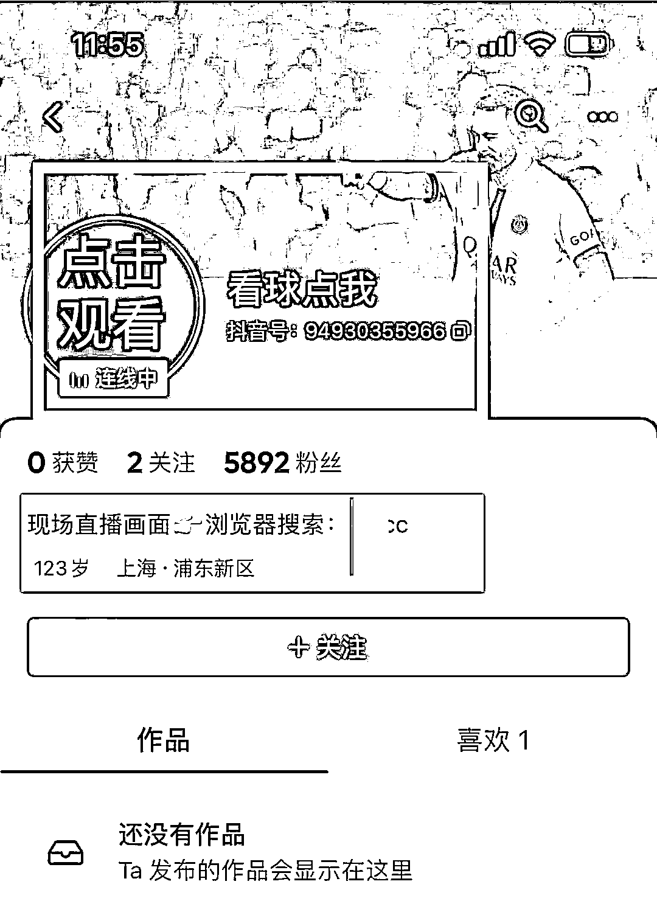
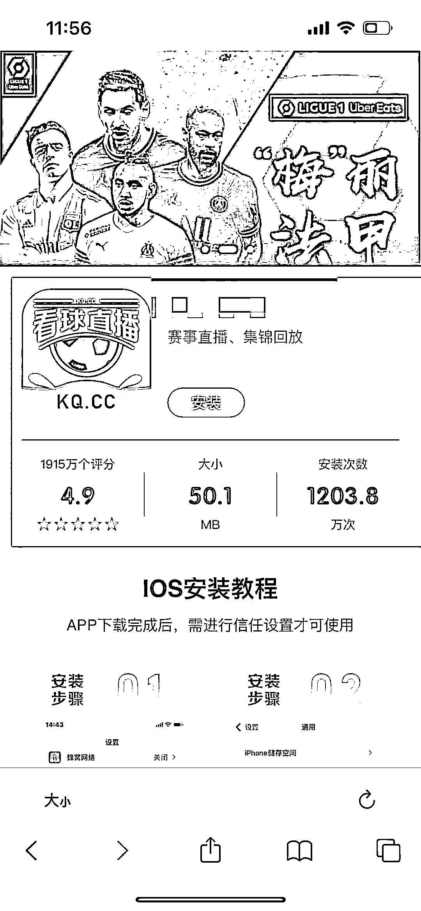

# 抖音采用投屏 + 连线转化流量的形式直播各大赛事

> 原文：[`www.yuque.com/for_lazy/xkrm14/rx5xcyx1h7dfsiax`](https://www.yuque.com/for_lazy/xkrm14/rx5xcyx1h7dfsiax)

作者： 波本零

日期：2023-04-27

点赞数：32

<ne-hole id="ufb94e89d" data-lake-id="ufb94e89d"><ne-card data-card-name="hr" data-card-type="block" id="WJvwf" data-event-boundary="card">

正文：

因为直播版权的原因，各大赛事是不能随便转播的，必须在专属的平台上才能看到，比如央 5，咪咕，腾讯体育等。很多球迷因为上班，上学没时间看视频，或者懒得为一场比赛付费的，就换选择看文字直播。 有人想到了用文字直播+同步视频直播解说的声音方法，在抖音采用的是投屏+连线转化流量。可以看到这个直播间流量很客观，2000+人长时间在线。通过连麦的广告入口，相信能转化不少精准流量。 这个人抓住用户找不到地方看视频直播的需求，用一个带有联系方式的小号连麦，封面+名称，在直播间精准引流，最后引流到一个看球直播的软件下载页面，赚取下载佣金。

<ne-card data-card-name="image" data-card-type="inline" id="spz1m" data-event-boundary="card"></ne-card>

<ne-card data-card-name="image" data-card-type="inline" id="XUUaP" data-event-boundary="card"></ne-card>

<ne-card data-card-name="image" data-card-type="inline" id="uOEdG" data-event-boundary="card"></ne-card>

<ne-hole id="u4958d54a" data-lake-id="u4958d54a"><ne-card data-card-name="hr" data-card-type="block" id="cNDVz" data-event-boundary="card">

评论区：

帅的想撞墙 : 上大学的时候没有流量，总看图文直播

大谢.₂₀₁7 : 很棒的观察，谢谢

<ne-hole id="uebbd6086" data-lake-id="uebbd6086"><ne-card data-card-name="hr" data-card-type="block" id="Tp9wf" data-event-boundary="card">

公众号懒人找资源，懒人专属群分享

</ne-card></ne-hole></ne-card></ne-hole></ne-card></ne-hole>