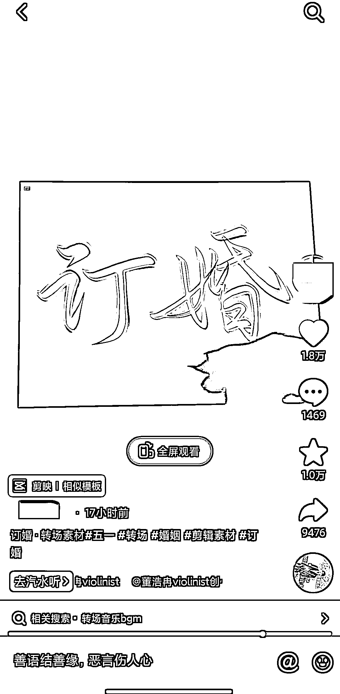

# 毛笔字、手绘类抖音起号，视频刚发 2 天直接爆了

> 原文：[`www.yuque.com/for_lazy/xkrm14/vi7sgrnbqnq45197`](https://www.yuque.com/for_lazy/xkrm14/vi7sgrnbqnq45197)

作者： 白宝香

日期：2023-04-27

点赞数：49

正文：

写字 毛笔字 手绘类抖音起号 这个新号这 2 天才开始发视频，直接爆了，我看了他后台【回家】播放量有 150w 左右，点赞 1.5w 【订婚】播放量 180w，点赞 1.7w，还在增长中 数据不错，可以参考这种方式起号 就是很简单的手机对着 ipad 拍视频，写字 话题是转场，应该是最近热门词，以及【回家】【订婚】也刚好是五一的热门词，第一个视频爆了，接住了流量。号起来可以准备变现。 很多人评论想写的字，后台也多人求笔刷 变现: 1.橱窗带货； 2.卖笔刷； 3.定制写字内容，如 9.9 元写 2-5 个字之类的，发原图给客户； 4.开直播，写字，让观众送粉丝牌刷礼物，评论字，马上在直播间写，停留一会给人时间截图； 5.卖练字写字课程，有自己的课程更好； 6.引流到私域，结合其他方式变现；

  <ne-p id="ua43c65e2" data-lake-id="ua43c65e2">

评论区：

JIE : 围观

白宝香 : 一起生财有术！

白宝香 : 感谢🎉

帅的想撞墙 : 字写的丑怎么破[捂脸]

白宝香 : 你去抖音搜，这种同款账号有好几个，有些字也不算特别好看，账号流量起来后，自己看具体怎么变现～

帅的想撞墙 : ～好的

公众号懒人找资源，懒人专属群分享

</ne-p>