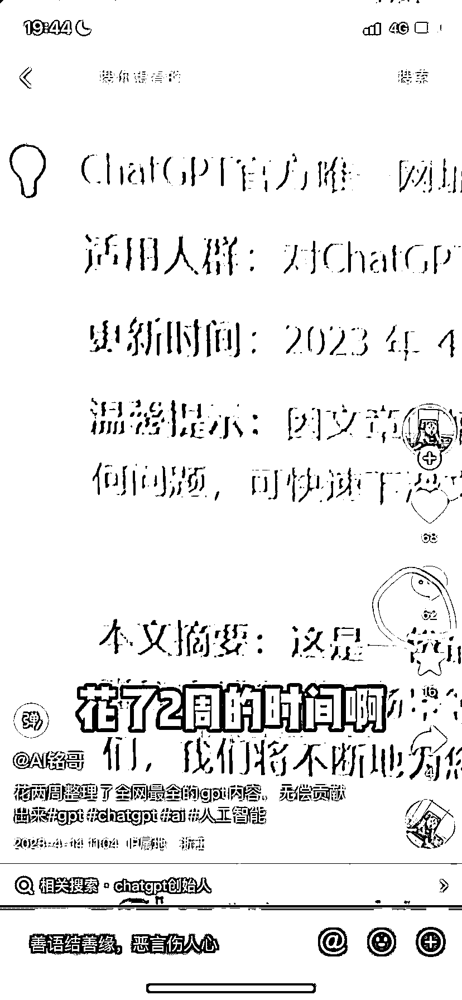
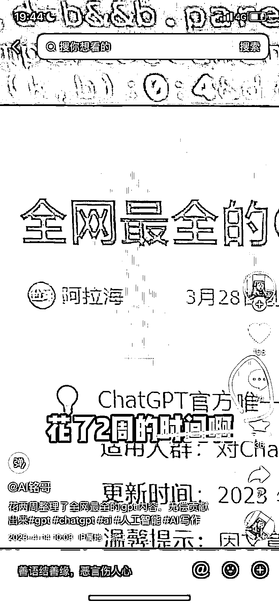
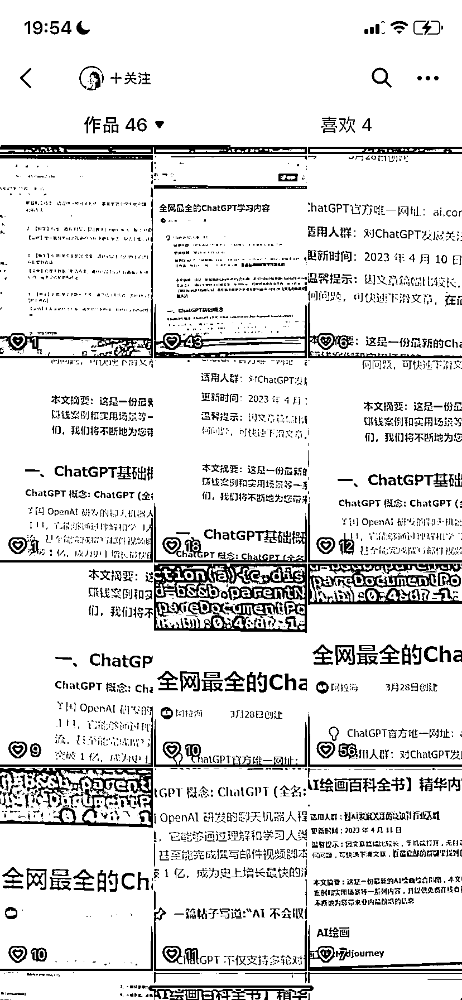
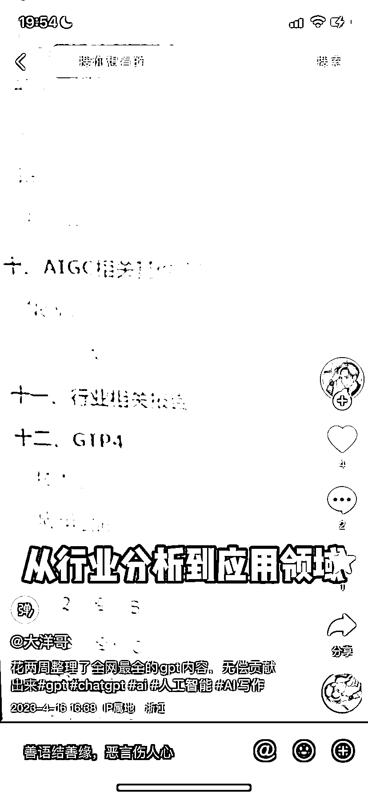

# 抖音 5+ 资料矩阵号，同最简单粗暴的方式 10 天引流 1500+

> 原文：[`www.yuque.com/for_lazy/xkrm14/gnlb8bef6i5wgfzd`](https://www.yuque.com/for_lazy/xkrm14/gnlb8bef6i5wgfzd)

作者： eason.

日期：2023-04-26

点赞数：66

正文：

没想到第一条风向标是因为别人拿自己整理的资料在抖音杀疯了，看了下从 14 号左右这个兄弟开了起码 5+矩阵号，最简单粗暴的方式，起码 10 天引流 1500+，作为资料主，站起来！有伙伴还没靠 GPT 赚钱的，还在窗口期，跟上

  

评论区：

bgz 洲洲 : 再多的信息差认知差，都比不上一个牛逼的执行力

lydia : 他是卖资料吗

田新一 : 你的资料能分享下吗

eason. : 是的，非常准确

eason. : 他是直接 39.9 卖我们免费送的资料 ，这种方式引流特别快，进了私域总能有转化

eason. : 当然呀

豆豆 : 哈哈哈哈哈哈哈

公众号懒人找资源，懒人专属群分享

</ne-p>