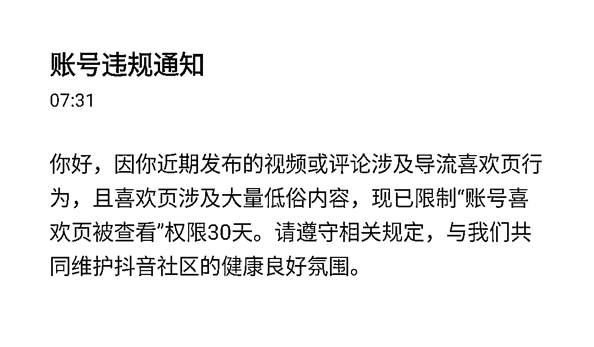

# 发现一个比较安全的抖音引流方法

> 原文：[`www.yuque.com/for_lazy/xkrm14/hmtcit0nnfmfk6mb`](https://www.yuque.com/for_lazy/xkrm14/hmtcit0nnfmfk6mb)

作者： 传奇

日期：2023-04-26

点赞数：58

<ne-hole id="uadc72b7e" data-lake-id="uadc72b7e"><ne-card data-card-name="hr" data-card-type="block" id="oYpKR" data-event-boundary="card">

正文：

发现一个比较安全的抖音引流方法：小号发三个视频，视频内容随意，三个视频的封面拼接成一个联系方式，这样小号相对安全。 大号点赞这三个视频，会出现在自己喜欢页面，然后大号引导粉丝看自己的喜欢页面。引导尺度没把握好，最多限制“喜欢页被查看 30 天”，目前有个号被限制，没其他处罚。

<ne-card data-card-name="image" data-card-type="inline" id="OCO7X" data-event-boundary="card">  <ne-hole id="u67cd7108" data-lake-id="u67cd7108"><ne-card data-card-name="hr" data-card-type="block" id="ZuXE0" data-event-boundary="card"><ne-p id="u9fdbc3a0" data-lake-id="u9fdbc3a0">评论区：

<ne-hole id="u1094087b" data-lake-id="u1094087b"><ne-card data-card-name="hr" data-card-type="block" id="l4Hwe" data-event-boundary="card">

公众号懒人找资源，懒人专属群分享

</ne-card></ne-hole></ne-card></ne-hole></ne-card></ne-p></ne-card></ne-hole>