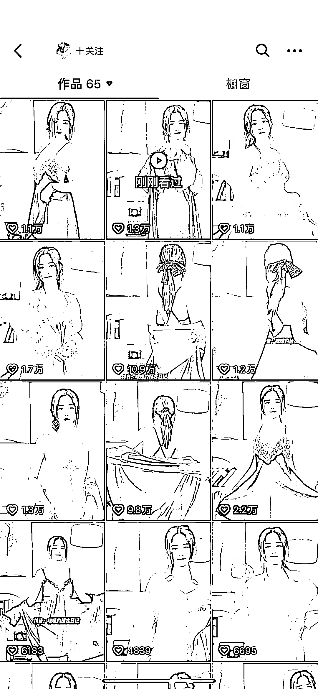

# 抖音轻奢风卖睡衣风格可以在小红书上用矩阵去放大

> 原文：[`www.yuque.com/for_lazy/xkrm14/sswnqvczb4ccm3nl`](https://www.yuque.com/for_lazy/xkrm14/sswnqvczb4ccm3nl)

作者： 胡北北

日期：2023-04-26

点赞数：67

正文：

最近这种卖睡衣的在抖音上很火，可能是因为夏天到了，视频主打一个真人出镜，轻奢风 思考:这个风格在小红书上用矩阵去放大，人群会更精准？且利润更大？ 请个模特一天就能拍几百条视频出来，亦或者用 ai 去生成视频

评论区：

梁有鱼🐟 : 这个项目从 20 年就一直想做，想到现在别人已经做起来了😂

胡北北 : 现在去做小红书也不晚

跃进 : 主打“性”，属于人类三大底层需求“贪嗔痴”。

梁有鱼🐟 : 有货源合作吗哈哈哈

孟里啥都有 : 有时间你看看他的直播间，[坏笑]

婴罂 : 我在小红薯上差点下单这种睡衣，一上拼多多，发现只要小红薯价格的一半，这个类目可搞啊

蜡蜡 Joanna : 同问有货源吗

公众号懒人找资源，懒人专属群分享

