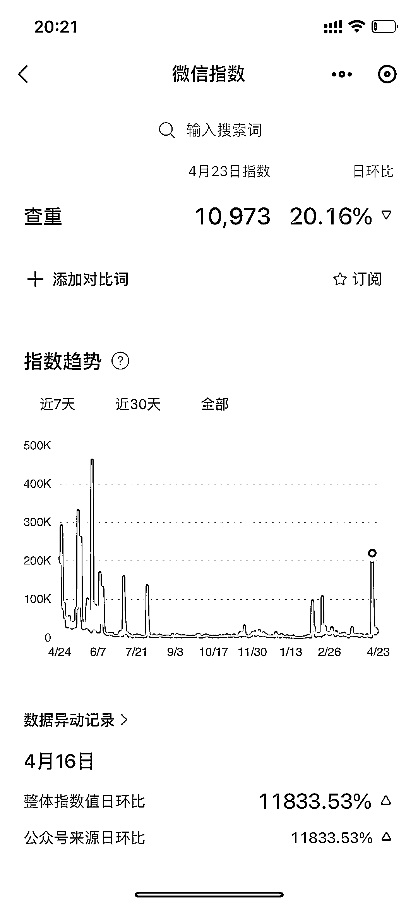
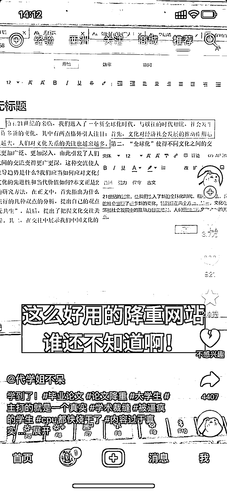
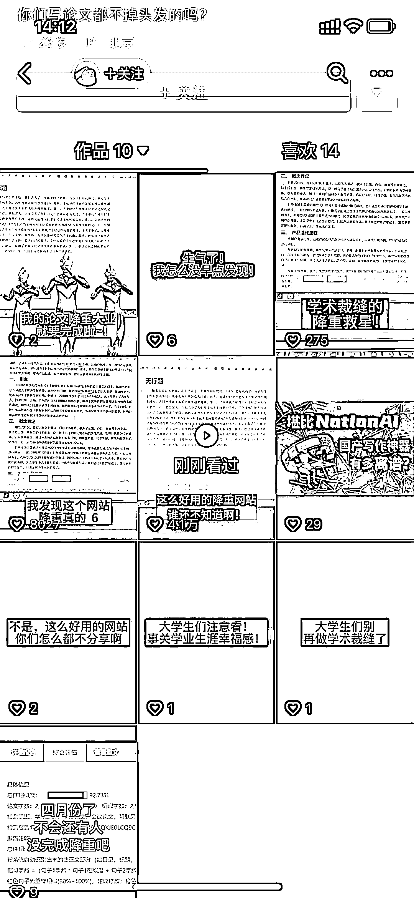

# 抖音发如何使用降重网站的视频，可以导流

> 原文：[`www.yuque.com/for_lazy/xkrm14/lh5yp3cstkdcso2i`](https://www.yuque.com/for_lazy/xkrm14/lh5yp3cstkdcso2i)

作者： 熊自由

日期：2023-04-24

点赞数：30

<ne-hole id="uc8dae600" data-lake-id="uc8dae600">

正文：

抖音发如何使用降重网站的视频，导流。 这个号是刚起，最近大学生们都在写论文，可以把握一下卖查重降重服务，靠自然流的流量就很不错。多找几个学生兼职帮发，导粉。在小红书上以消费者角度真诚种草得到正反馈的概率更大，群体很大一部分就是女大学生。 虽然现在微信指数降下来了，但是论文完成撰写，还要改很多次稿，终稿前还有很多波流量机会，如图二，去年初稿后，到确认终稿有好几次异常值。

<ne-hole id="u96c34ea2" data-lake-id="u96c34ea2">

评论区：

<ne-hole id="u24c5982c" data-lake-id="u24c5982c">

公众号懒人找资源，懒人专属群分享

</ne-hole></ne-hole></ne-hole>