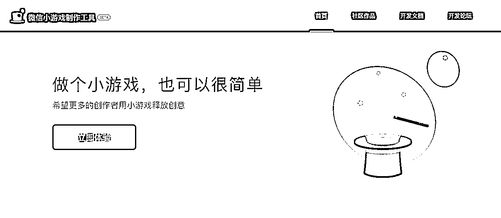

# 微信通过小游戏可以很好的实现裂变引流

> 原文：[`www.yuque.com/for_lazy/xkrm14/whpq4all14nbgw33`](https://www.yuque.com/for_lazy/xkrm14/whpq4all14nbgw33)

作者： 若尘 404

日期：2023-05-02

点赞数：77

<ne-hole id="u9ededab2" data-lake-id="u9ededab2"><ne-card data-card-name="hr" data-card-type="block" id="CsAMh" data-event-boundary="card">

正文：

开发一个微信小游戏的成本已经非常低了 👻👻👻 通过小游戏可以很好的实现裂变引流 🎉🎉🎉 私域游戏化路线是一个很好的探索方向 [微信小游戏制作工具](https://gamemaker.weixin.qq.com/)

<ne-card data-card-name="image" data-card-type="inline" id="hGbQ1" data-event-boundary="card">  <ne-p id="u0bac1379" data-lake-id="u0bac1379"><ne-card data-card-name="image" data-card-type="inline" id="cFO9p" data-event-boundary="card">  <ne-hole id="ue727b9f3" data-lake-id="ue727b9f3"><ne-card data-card-name="hr" data-card-type="block" id="lZ4sw" data-event-boundary="card"><ne-p id="u376077a9" data-lake-id="u376077a9">评论区：

<ne-hole id="u507ee985" data-lake-id="u507ee985"><ne-card data-card-name="hr" data-card-type="block" id="XSrtD" data-event-boundary="card">

公众号懒人找资源，懒人专属群分享

</ne-card></ne-hole></ne-card></ne-hole></ne-card></ne-p></ne-card></ne-p></ne-card></ne-hole>