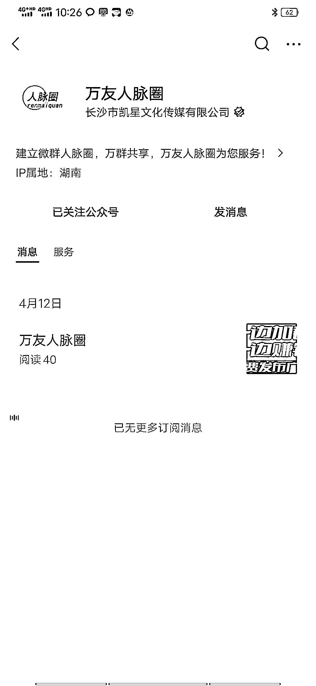
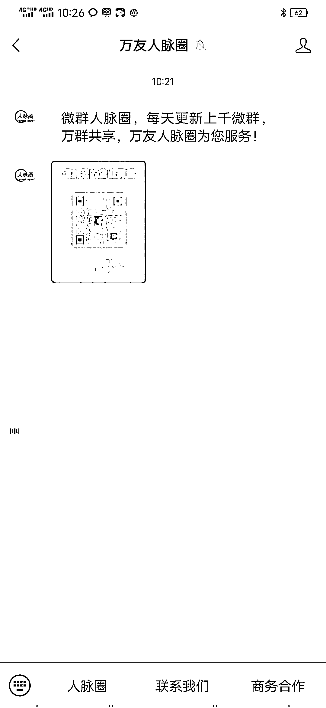
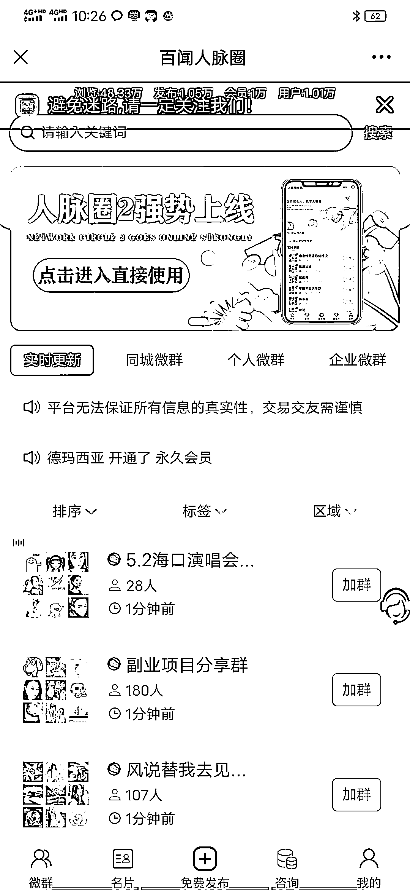

# 利用小程序搭建的群二维码分享，玩法很多

> 原文：[`www.yuque.com/for_lazy/xkrm14/kxtbm5wfr09u5t47`](https://www.yuque.com/for_lazy/xkrm14/kxtbm5wfr09u5t47)

作者： 曾崯晟

日期：2023-05-01

点赞数：27

<ne-hole id="uf142b8d9" data-lake-id="uf142b8d9"><ne-card data-card-name="hr" data-card-type="block" id="tSR1k" data-event-boundary="card">

正文：

看到 的分享，在微信上搜了下(见附图)，这种利用小程序搭建的群二维码分享，玩法是很多的，运营得好可双向收费，成本也低，可试。 关键点是不同板块的资源整合。 例如 网赚板块: 提供网赚信息(gpt 帐号分销、课程售卖、各种平台撸佣金信息等等)，可针对入群收个 9.9 阿米巴板块: 每个群里都包含导师自愿者及各种技能人士，群主发布任务招幕线上服务团队，解决商家各类需求。相当于做商家服务外包） 同城板块: 帮助同城商家实现活动曝光及引流 ... 可发散的太多了，工具技术上也是可行的，关键是: 人呀...

<ne-card data-card-name="image" data-card-type="inline" id="Q8Ty6" data-event-boundary="card"></ne-card>

<ne-card data-card-name="image" data-card-type="inline" id="MI8ir" data-event-boundary="card"></ne-card>

<ne-card data-card-name="image" data-card-type="inline" id="bwnC9" data-event-boundary="card"></ne-card>

<ne-card data-card-name="image" data-card-type="inline" id="gjoiY" data-event-boundary="card"></ne-card>

<ne-hole id="u54f8b416" data-lake-id="u54f8b416"><ne-card data-card-name="hr" data-card-type="block" id="jy7Qw" data-event-boundary="card">

评论区：

曾崯晟 :

<ne-hole id="u92db5126" data-lake-id="u92db5126"><ne-card data-card-name="hr" data-card-type="block" id="SNIQK" data-event-boundary="card">

公众号懒人找资源，懒人专属群分享

</ne-card></ne-hole></ne-card></ne-hole></ne-card></ne-hole>