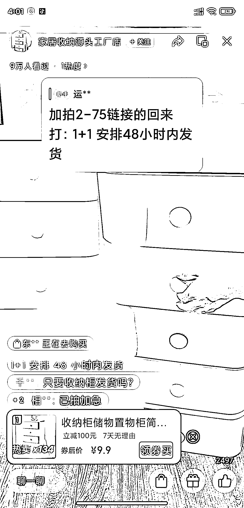

# 百货类名字加上【源头工厂】 收纳柜，视频号直播场景易模仿

> 原文：[`www.yuque.com/for_lazy/xkrm14/ts0g9p0hlwuobrg4`](https://www.yuque.com/for_lazy/xkrm14/ts0g9p0hlwuobrg4)

作者： 左超

日期：2023-04-30

点赞数：71

<ne-hole id="ub35fe7db" data-lake-id="ub35fe7db">

正文：

百货类，名字加上【源头工厂】 收纳柜，视频号直播场景很容易模仿，直播话术也比较简单，直接直播出单

<ne-hole id="ua255d194" data-lake-id="ua255d194">

评论区：

老彭 : 源头工厂 4 个字确实好用

BLUE : 很多号都这么来

野猫 : 饮水思源，这一次，水被利用了

万能神 : 源头工厂===一手货源，想着便宜

桃花 : 关键是“源头工厂”的场景怎么实现呢？找厂家合作吗

豆豆 : 只是这么说而已，到底是不是没人会追究

左超 : ？

<ne-hole id="u19104fd7" data-lake-id="u19104fd7">

公众号懒人找资源，懒人专属群分享

</ne-hole></ne-hole></ne-hole>