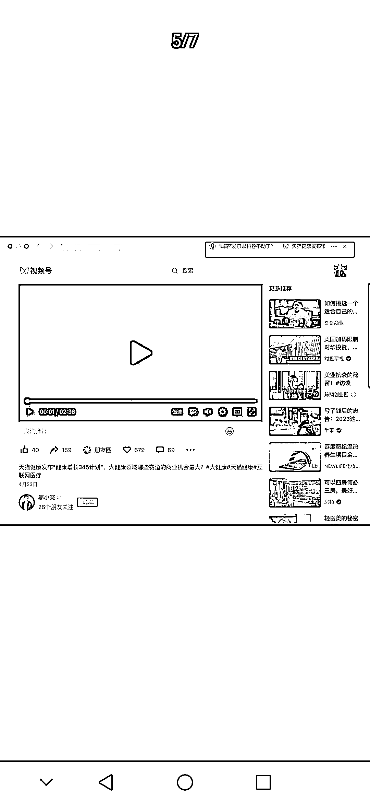

# iOS 微信又发布了 8.0.37 正式版，三个新功能开始灰度内测

> 原文：[`www.yuque.com/for_lazy/xkrm14/lpskusr1s9x7zxwg`](https://www.yuque.com/for_lazy/xkrm14/lpskusr1s9x7zxwg)

<ne-p id="ucc9df96f" data-lake-id="ucc9df96f"><ne-text id="u4cb3adbf">作者： 作书</ne-text></ne-p> <ne-p id="u41107879" data-lake-id="u41107879"><ne-text id="u59b76532">日期：2023-04-29</ne-text></ne-p> <ne-p id="ud5edebc4" data-lake-id="ud5edebc4"><ne-text id="u3c53133b">点赞数：</ne-text><ne-text id="u077ca441" ne-bold="true">24</ne-text></ne-p> <ne-hole id="ufc753bc6" data-lake-id="ufc753bc6"><ne-card data-card-name="hr" data-card-type="block" id="Fa0vf" data-event-boundary="card"><ne-p id="u26ea3c24" data-lake-id="u26ea3c24"><ne-text id="u785fa05a">正文：</ne-text></ne-p> <ne-p id="uad0f30ef" data-lake-id="uad0f30ef"><ne-text id="udb8361d9">继 iOS 微信 8.0.36 版本更新仅一周后，昨日 iOS 微信又发布了 8.0.37 正式版，三个新功能开始灰度内侧： 改版 1：微信群和视频号继续深度打通</ne-text> <ne-text id="uaa5841d2">新版本中，微信群的设置界面新增了“视频号”功能，该功能支持群内成员共同运营一个视频号账号，并能在云端保存群内视频，不过该功能还在内测中，只有少部分</ne-text> <ne-text id="uc06bd28f">8.0.37 版用户可以体验到。 改版 2：视频号小店将“挤进”公众号主页</ne-text> <ne-text id="u414568c7">除了微信群，视频号灰度内测的“触角”还伸向了公众号。如下图 2 所示，微信公众号主页还支持直接添加“视频号小店”入口。 改版 3：微信 Mac 版可同时打开多个页面</ne-text> <ne-text id="u7fd81df3">除这些 ios 端更新外，Mac 版微信在前几天也迎来了 3.7.1 版本更新。</ne-text> <ne-text id="u605779d2">以往 Mac 微信只能同时开启一个网页窗口，在新版本更新后，微信 mac 客户端公众号链接和视频号等一系列页面均可同时打开。本次更新极大增加了微信内阅读的舒适度，使用户获得更丝滑的阅读体验。</ne-text></ne-p> <ne-p id="u0347dbae" data-lake-id="u0347dbae"><ne-card data-card-name="image" data-card-type="inline" id="qDboL" data-event-boundary="card">  <ne-p id="u3af376fb" data-lake-id="u3af376fb"><ne-card data-card-name="image" data-card-type="inline" id="zXggD" data-event-boundary="card">  <ne-p id="udbf5bd33" data-lake-id="udbf5bd33"><ne-card data-card-name="image" data-card-type="inline" id="Yc1kH" data-event-boundary="card">  <ne-hole id="u1407716c" data-lake-id="u1407716c"><ne-card data-card-name="hr" data-card-type="block" id="hvQIE" data-event-boundary="card"><ne-p id="u891b288f" data-lake-id="u891b288f"><ne-text id="u41059a93">评论区：</ne-text></ne-p> <ne-p id="u8f51b18f" data-lake-id="u8f51b18f"><ne-text id="u0c064865">大谢.₂₀₁7 : 感谢分享，想知道每次微信更新，具体的更新内容，在哪里可以查看呢，谢谢</ne-text></ne-p> <ne-p id="ub7dfe0da" data-lake-id="ub7dfe0da"><ne-text id="u817380f0">作书 : 微信放大镜🔍“每次微信更新，具体的更新内容在哪里可以查看”，或自己更新最新版本，试试呗，抑或微信官方平台</ne-text></ne-p> <ne-p id="uaffb72de" data-lake-id="uaffb72de"><ne-text id="u3260cc18">作书 : 感谢亦仁大大</ne-text></ne-p> <ne-hole id="ue2d2bfac" data-lake-id="ue2d2bfac"><ne-card data-card-name="hr" data-card-type="block" id="MkMyn" data-event-boundary="card"><ne-p id="u921153ce" data-lake-id="u921153ce"><ne-text id="u4ae32a3f">公众号懒人找资源，懒人专属群分享</ne-text></ne-p></ne-card></ne-hole></ne-card></ne-hole></ne-card></ne-p></ne-card></ne-p></ne-card></ne-p></ne-card></ne-hole>