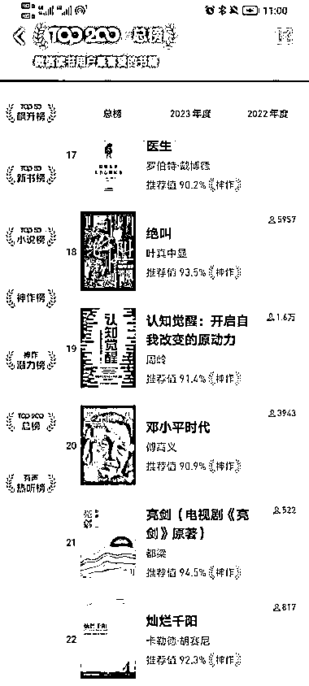
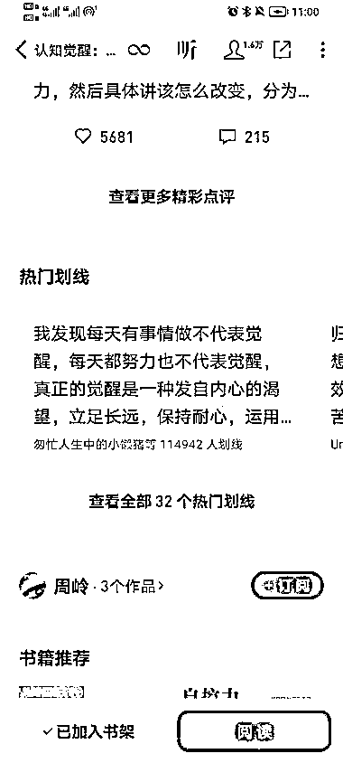

# 微信读书热门书籍榜单的热门划线内容，可以作为写作素材

> 原文：[`www.yuque.com/for_lazy/xkrm14/visiwmpagm8ri7bf`](https://www.yuque.com/for_lazy/xkrm14/visiwmpagm8ri7bf)

作者： 简冬阳

日期：2023-04-27

点赞数：201

<ne-hole id="u9876a70b" data-lake-id="u9876a70b">

正文：

在微信读书的热榜里面找热门书籍，然后找到热门划线部分，可以看到被大部分读者都认可的划线内容，这些都是很好的写作素材

  <ne-p id="u2e196571" data-lake-id="u2e196571">  <ne-hole id="u02b4b998" data-lake-id="u02b4b998"><ne-p id="u32e35feb" data-lake-id="u32e35feb">评论区：

Hilo : 发散一下:可否嵌入日历寻找合作机会

叨叨 : 我觉得甚至可以把文案做成视频 在抖音卖书

简冬阳 : 生财的圈友怎么都这么机智，学到了

简冬阳 : 没太听懂耶

Hilo : 精美日记，每天一句人生格言，出处，二维码卖书之类的

Hilo : 👍

莲子暖暖 : 咦，还可以这样，太好奇了

<ne-hole id="u39ea9b24" data-lake-id="u39ea9b24">

公众号懒人找资源，懒人专属群分享

</ne-hole></ne-hole></ne-p></ne-p></ne-hole>