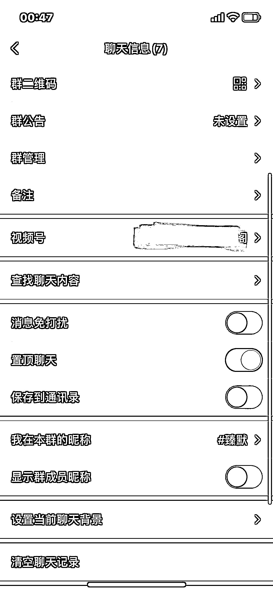

# 微信炸裂功能：群视频号

> 原文：[`www.yuque.com/for_lazy/xkrm14/tdt8qxkymi00kppt`](https://www.yuque.com/for_lazy/xkrm14/tdt8qxkymi00kppt)

作者： 臻默

日期：2023-04-27

点赞数：109

正文：

微信炸裂功能：群视频号！ 内测到部分群可以开通群视频号，每个群员都是管理员。这将把社群和视频号打通。 - 联动运营。未来群连麦，群直播，群活动，群电商都将一起，甚至有可能成为付费社群的运营模式。 - 超级个体。个人微信将意味着有多个视频号多重身份，在社会角色中，个人微信号扮演「本我」的角色，而视频号则是「超我」的多重角色。想象出席不同的场合，你手里有一打不同的名片。 - 激活场域。社群也将变成视频号主题分发和精细化运营最有利的场域，微信冰山下的一切，都在群里呈现。

  <ne-p id="u7445d6ee" data-lake-id="u7445d6ee">  <ne-p id="u4275e9e8" data-lake-id="u4275e9e8">评论区：

艾小飞 : 看得出腾讯现在开放扶持视频号的力度越来越大了。不错不错

飞 : 群成员的上限还是 500 人吗？

臻默 : 群依然是 500 人，但因为有些群员没有内测到这个功能，所以并不是所有人都能看到。

大谢.₂₀₁7 : 微信算是发挥自己的优势，增加了用户粘性，但内容质量和数量，是更重要的事情。

公众号懒人找资源，懒人专属群分享

</ne-p></ne-p>