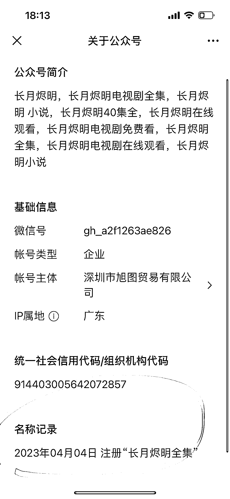
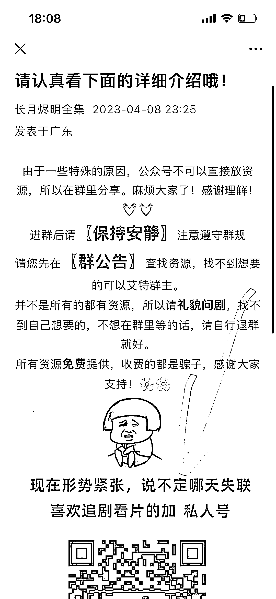

# 根据最近热播影视剧创建同名公众号，引流到微信很快

> 原文：[`www.yuque.com/for_lazy/xkrm14/qpgs9w8paakanwqq`](https://www.yuque.com/for_lazy/xkrm14/qpgs9w8paakanwqq)

作者： 一念

日期：2023-04-26

点赞数：54

<ne-hole id="u883eee42" data-lake-id="u883eee42"><ne-card data-card-name="hr" data-card-type="block" id="s6uBE" data-event-boundary="card">

正文：

根据最近热播影视剧创建同名公众号，公众号引流微信，再拉分享群，分享影视更新剧的同时，卖自己的产品，只能说引流太快…

<ne-card data-card-name="image" data-card-type="inline" id="rWOji" data-event-boundary="card">  <ne-p id="u6e0398d3" data-lake-id="u6e0398d3"><ne-card data-card-name="image" data-card-type="inline" id="jGuVG" data-event-boundary="card">  <ne-p id="ue0bee600" data-lake-id="ue0bee600"><ne-card data-card-name="image" data-card-type="inline" id="ITCyl" data-event-boundary="card">  <ne-p id="ub0c76ccd" data-lake-id="ub0c76ccd"><ne-card data-card-name="image" data-card-type="inline" id="tepoF" data-event-boundary="card">  <ne-p id="udc0eab5e" data-lake-id="udc0eab5e"><ne-card data-card-name="image" data-card-type="inline" id="u3h8b" data-event-boundary="card">  <ne-p id="ud059a434" data-lake-id="ud059a434"><ne-card data-card-name="image" data-card-type="inline" id="T0FfI" data-event-boundary="card">  <ne-hole id="udd474f46" data-lake-id="udd474f46"><ne-card data-card-name="hr" data-card-type="block" id="Crqiu" data-event-boundary="card"><ne-p id="u8e566d08" data-lake-id="u8e566d08">评论区：

上川书记 : 这个不怕打官司吗

21 号 : 这绝对侵权

一念 : 哇~谢谢亦仁大大！ 悦分享越幸运~

My Dream : 这不怕侵权吗？

一念 : 侵权无处不在，一是没人监管，电视剧方也不愿意去管，因为犯不上，二是这种情况可能侧面促进了电视剧的传播，从而给电视剧制片方带来了更大的利益。利弊平衡全靠自己了~

轩辕 : 这种会风公众号，渠道多的可以搞。刚去了，3 天引流，1700 人。

一念 : [强][强][强]实战派

<ne-hole id="u60f39dfc" data-lake-id="u60f39dfc"><ne-card data-card-name="hr" data-card-type="block" id="HbWjD" data-event-boundary="card">

公众号懒人找资源，懒人专属群分享

</ne-card></ne-hole></ne-card></ne-hole></ne-card></ne-p></ne-card></ne-p></ne-card></ne-p></ne-card></ne-p></ne-card></ne-p></ne-card></ne-p></ne-card></ne-hole>