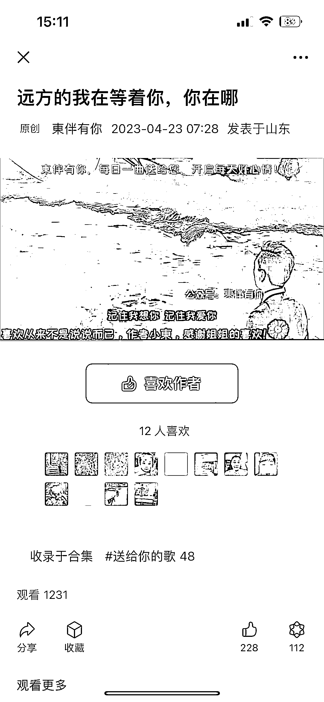
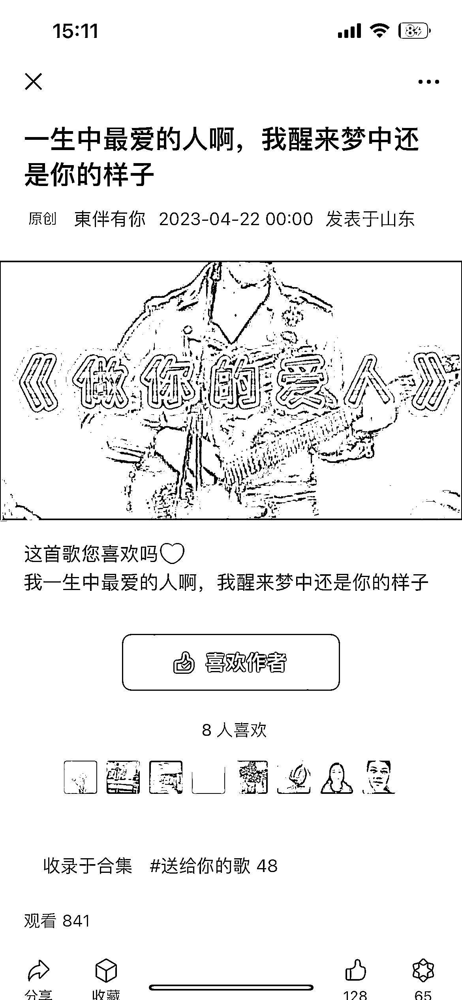

# 公众号老年人粉变现，效果不错

> 原文：[`www.yuque.com/for_lazy/xkrm14/udn7src4qg6ufdb0`](https://www.yuque.com/for_lazy/xkrm14/udn7src4qg6ufdb0)

作者： 爱引流的一一

日期：2023-04-26

点赞数：56

<ne-hole id="uc8cd33fc" data-lake-id="uc8cd33fc">

正文：

公众号老年人粉变现，爽歪歪。

<ne-hole id="u6a857e1a" data-lake-id="u6a857e1a">

评论区：

志存高远 : 看不太懂。老年人为歌曲打赏 199？

九帆 : 可以理解为共识买单，感同身受，一种情绪价值。

Demi : 不一定就按上面价格给钱吧，还有其它金额。不过思路不错。

A .陈宸 : 这个真 6 啊，最低打赏 199

杨志鹏 : 最低是 52，但是我觉得金额有点高，还是要做一些调整，最好最高就在 100 或者出头

江大虾 : 初始流量哪里来的呢

星火燎原 : 有些歌都是没人打赏的，有些是两三个打赏，超过 6 个打赏的很少。

<ne-hole id="u5fbcceac" data-lake-id="u5fbcceac">

公众号懒人找资源，懒人专属群分享

</ne-hole></ne-hole></ne-hole>