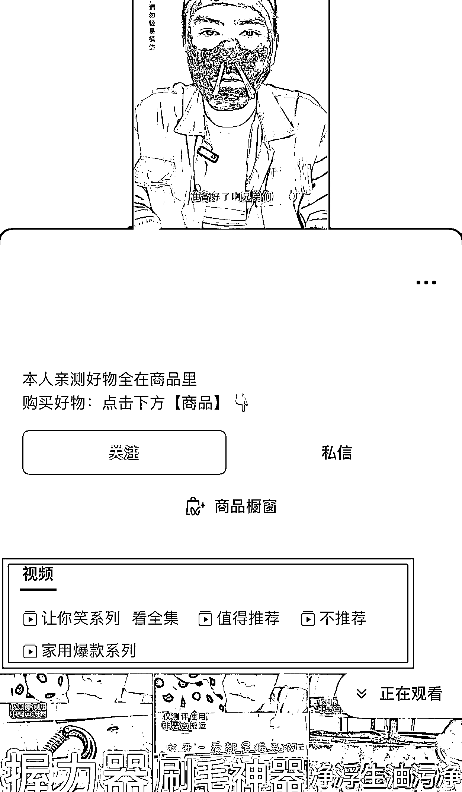
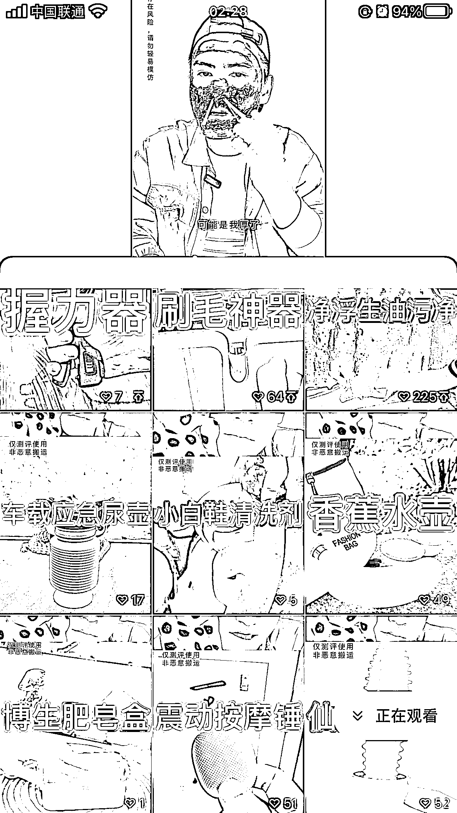
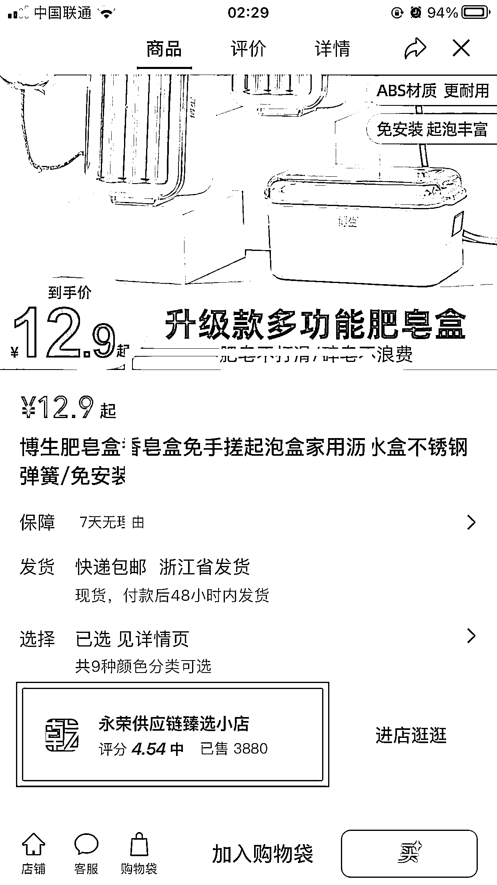
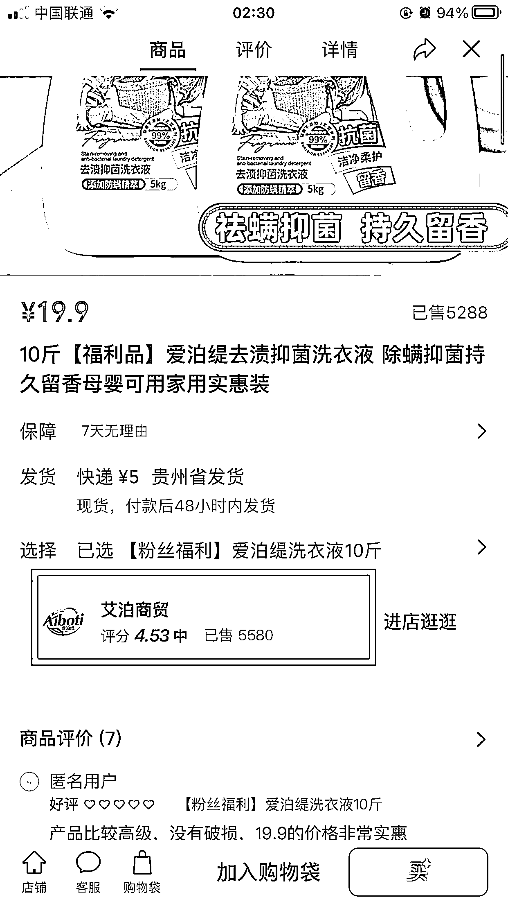
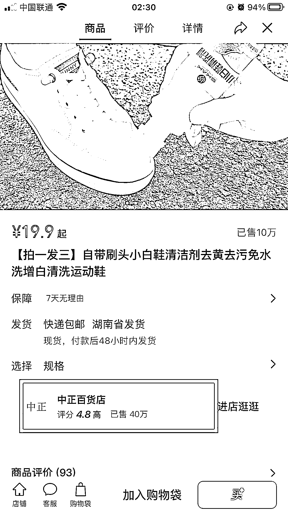

# 视频号可复制案例，成本低，可行性高

> 原文：[`www.yuque.com/for_lazy/xkrm14/rt9glbcb7ngv8we8`](https://www.yuque.com/for_lazy/xkrm14/rt9glbcb7ngv8we8)

作者： 江姿航

日期：2023-04-24

点赞数：81

正文：

视频号可复制案例，成本低，可行性高。 前期投入不高，只需要买测品，好的直接上链接，不好的把测试视频直接发出来吃流量就可以！（买的东西好不好自己都留着用） 按图分析，我们一张往下看。 第一张：首先。点进主页就可以看到分类好的合集，这更有利于转化，买东西的人直接就可以点推荐，不用翻来翻去，不知道哪个是能用的。小指头细节，引导橱窗，测品类账号变现的方式非常直接，就是卖货，只要上橱窗就能变现，最主要的是推荐的东西不一定好用，一般也是会去看商家给到的佣金去衡量（这是一般情况）。图 3️⃣，4️⃣，5️⃣，看看商家，就知道不是博主自己的产品。 第二张：封面做的很一般，视频的剪辑也很糙，相对新人来说，门槛较低，可直接搬运脚本模仿测试，一部手机，买好测品，必要的时候买个无线领夹麦克风，价格有高有低，刚开始买入门的就 ok！简单的会点剪影，就可以直接上手。测品视频的剪辑逻辑大概是：先上别人的宣传视频。然后来一句台词（走，找强子拿货。二狗，取东西等等，而这段视频只要一次录好，后边一直能用，且能形成固定的风格，更容易留人。）之后就是上手测，学别人的样子，刚开始录可能不自然，慢慢练就习惯了，而且会越录越顺。 第三四五张图上面说过了。 第六张图直观明了，就是爆单的品也不少，销量很厉害。不会选品就看人卖什么品，说好听点就是学。说不好听点就是搬。 后期只要有流量，商家直接给你寄品，让你测，所以还是值得一搞的。 案例搬过来了，圈友们行动起来！

  

评论区：

麦子 : 有专门大量租视频号做这类的

陈真 : 买的测试产品可以加运费再卖出去[得意]

江姿航 : 可玩！

江姿航 : 感谢

爱吃鱼丸的蓝波 : 怎么做

久违 : 你好，可以分享一下这个视频号的名字吗，想看看

江姿航 : 李三金测评

公众号懒人找资源，懒人专属群分享

</ne-p>