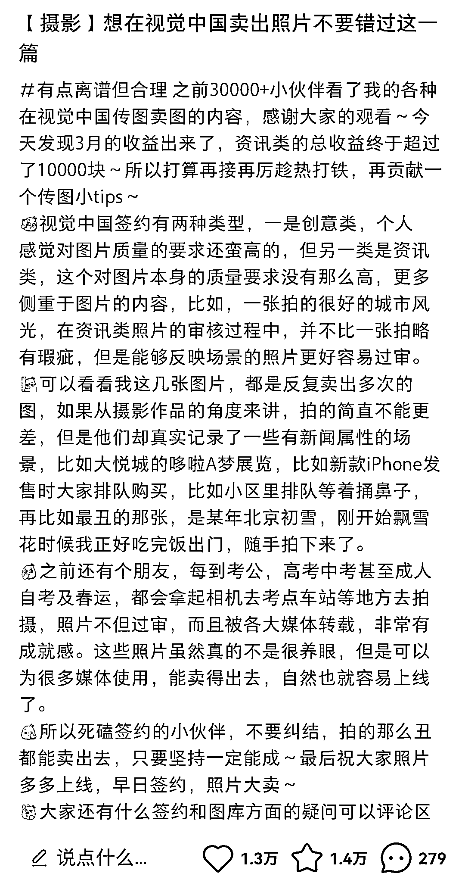

# 视觉中国签约视讯类能够上传平时拍的人山人海照片

> 原文：[`www.yuque.com/for_lazy/xkrm14/aw77znbsgh0gyga9`](https://www.yuque.com/for_lazy/xkrm14/aw77znbsgh0gyga9)

<ne-p id="ucc334959" data-lake-id="ucc334959"><ne-text id="u57b72c68">作者： Cora</ne-text></ne-p> <ne-p id="ua876860c" data-lake-id="ua876860c"><ne-text id="u507f04bf">日期：2023-05-03</ne-text></ne-p> <ne-p id="u0bd2ef23" data-lake-id="u0bd2ef23"><ne-text id="ua6a3f2fe">点赞数：</ne-text><ne-text id="u302163f4" ne-bold="true">58</ne-text></ne-p> <ne-hole id="uebc671fb" data-lake-id="uebc671fb"><ne-card data-card-name="hr" data-card-type="block" id="aboNo" data-event-boundary="card"><ne-p id="u0bfc7e9e" data-lake-id="u0bfc7e9e"><ne-text id="u9998c8df">正文：</ne-text></ne-p> <ne-p id="uaf61bcae" data-lake-id="uaf61bcae"><ne-text id="uf43d578f">在视觉中国签约视讯类的，平时拍的人山人海照片都可以上传上去</ne-text></ne-p> <ne-p id="u01f283cc" data-lake-id="u01f283cc"><ne-card data-card-name="image" data-card-type="inline" id="wzI5t" data-event-boundary="card">  <ne-hole id="ue34eba22" data-lake-id="ue34eba22"><ne-card data-card-name="hr" data-card-type="block" id="ipD7U" data-event-boundary="card"><ne-p id="u373d6b53" data-lake-id="u373d6b53"><ne-text id="u12c70701">评论区：</ne-text></ne-p> <ne-p id="u9abff9f0" data-lake-id="u9abff9f0"><ne-text id="ufd57a212">吴间道 : 还以为每次这样的新闻都是各报社自己的记者去拍的</ne-text></ne-p> <ne-p id="u3be0d370" data-lake-id="u3be0d370"><ne-text id="u3dda5008">Revolution* : 在视觉中国注册就可以吗？</ne-text></ne-p> <ne-p id="ud2b05559" data-lake-id="ud2b05559"><ne-text id="u80873478">Cora : 你可以看看这条链接，了解一下：</ne-text>[<ne-text id="uca606f69">摄影爱好者，想在视觉中国签约供稿，能否帮忙解答一些疑惑？+-+知乎</ne-text>](https://www.zhihu.com/question/441183458)</ne-p> <ne-hole id="u17a0d0b8" data-lake-id="u17a0d0b8"><ne-card data-card-name="hr" data-card-type="block" id="UBuNd" data-event-boundary="card"><ne-p id="u708d5f33" data-lake-id="u708d5f33"><ne-text id="u25d6d956">公众号懒人找资源，懒人专属群分享</ne-text></ne-p></ne-card></ne-hole></ne-card></ne-hole></ne-card></ne-p></ne-card></ne-hole>