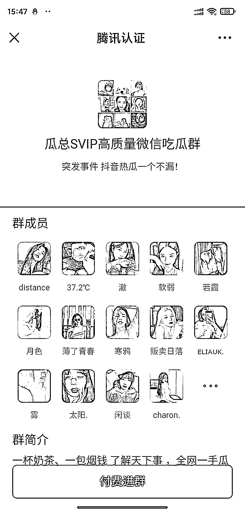
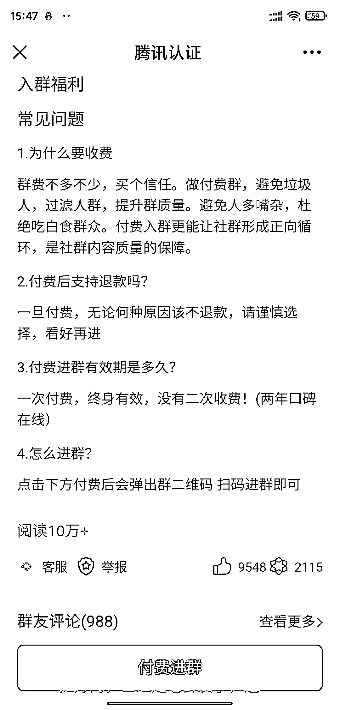
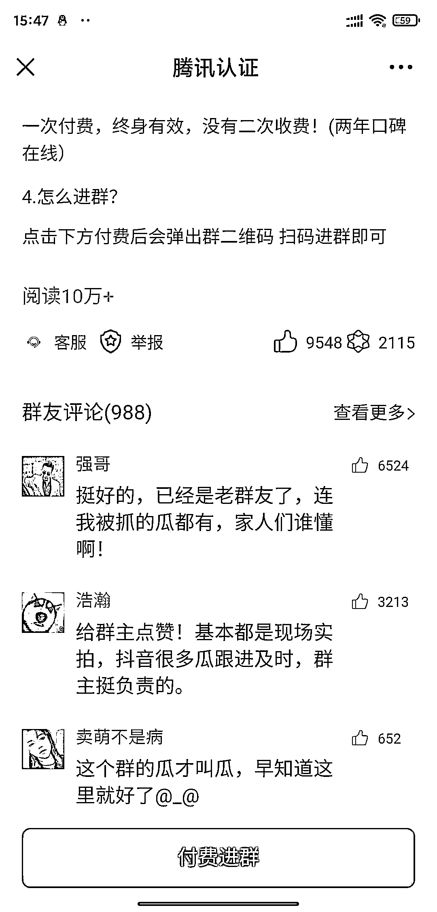
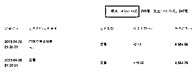
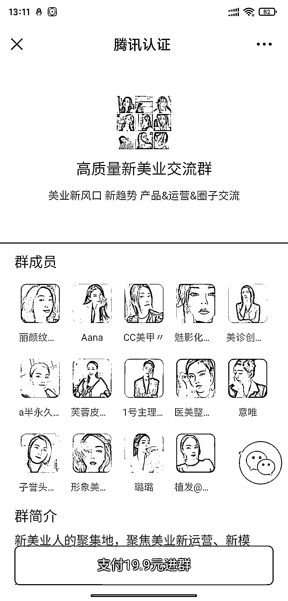
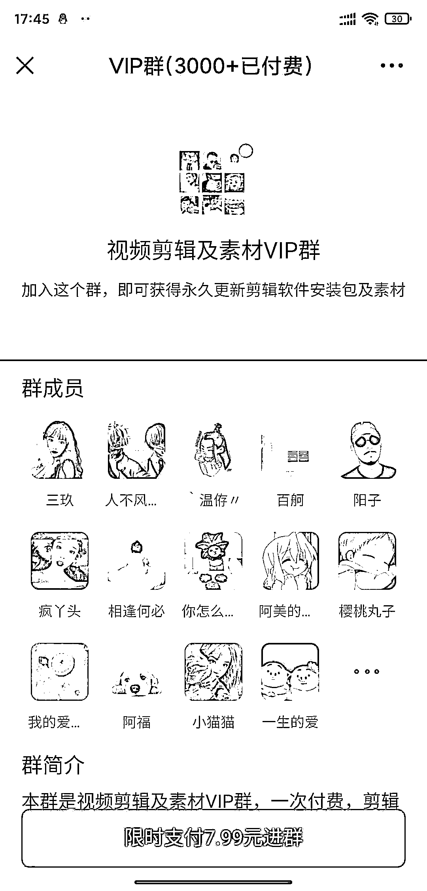

# 利用“九块九进群”付费系统做的吃瓜群，搭建不到 3 天，赚了 4 千多

> 原文：[`www.yuque.com/for_lazy/xkrm14/dr51guqw3zbk90tl`](https://www.yuque.com/for_lazy/xkrm14/dr51guqw3zbk90tl)

<ne-text id="u63a9a094">作者： 修心阿</ne-text>

<ne-text id="uefbfdb79">日期：2023-04-27</ne-text>

<ne-text id="ua9d88f13">点赞数：</ne-text><ne-text id="u79535f80" ne-bold="true">85</ne-text>

<ne-hole id="ucd9ed574" data-lake-id="ucd9ed574"><ne-card data-card-name="hr" data-card-type="block" id="ge3kl" data-event-boundary="card">

<ne-text id="u281c3e38">正文：</ne-text>

<ne-text id="u9c3c91c2">分享一个利用＜九块九进群＞付费入群系统做的吃瓜群。非常不错，搭建不到 3 天，赚了 4 千多，吃瓜，一直火[嘿哈]相关类别的各种付费群</ne-text> <ne-text id="u1a20ae1d">很多、比如 ppt，闲鱼交流群、表情包、脱单群等。抖音上经常可以看到的玩法、9.9 自动付费进群的玩法很流畅不用加好友付款。这个项目很多年了、一直很赚玩法多样化。有兴趣的可以尝试一下，抖音短视频直播引流、付费类型多种多样，各类微信群、简单高效。</ne-text>

<ne-card data-card-name="image" data-card-type="inline" id="st9hl" data-event-boundary="card">  <ne-p id="u740f442e" data-lake-id="u740f442e"><ne-card data-card-name="image" data-card-type="inline" id="etVUH" data-event-boundary="card"></ne-card>

<ne-card data-card-name="image" data-card-type="inline" id="Qw4Eb" data-event-boundary="card"></ne-card>

<ne-card data-card-name="image" data-card-type="inline" id="FuGn4" data-event-boundary="card">  <ne-p id="u84ff6f91" data-lake-id="u84ff6f91"><ne-card data-card-name="image" data-card-type="inline" id="LkJ5C" data-event-boundary="card"></ne-card>

<ne-card data-card-name="image" data-card-type="inline" id="UUI81" data-event-boundary="card"></ne-card>

<ne-card data-card-name="image" data-card-type="inline" id="S9N3x" data-event-boundary="card"></ne-card>

<ne-card data-card-name="image" data-card-type="inline" id="cLpjU" data-event-boundary="card"></ne-card>

<ne-card data-card-name="image" data-card-type="inline" id="XhUQm" data-event-boundary="card"></ne-card>

<ne-hole id="u13c13dd5" data-lake-id="u13c13dd5"><ne-card data-card-name="hr" data-card-type="block" id="rrpgB" data-event-boundary="card">

<ne-text id="uaa3cd5f6">评论区：</ne-text>

<ne-text id="u9672616f">阿聪 : 如何搭建呢[强]</ne-text>

<ne-text id="u8b9c31a7">修心阿 : 有相关的程序。微擎上有卖的。</ne-text>

<ne-text id="ua7188b72">阿聪 : 好的，谢谢</ne-text>

<ne-text id="ue3933576">莲子暖暖 : 这个可以哦！</ne-text>

<ne-text id="u52a9a40d">修心阿 : 确实是不错哦</ne-text>

<ne-text id="u2ca4fcf4">偏执狂 : 不好意思，请问这是个网站上的还是啥，没搜到</ne-text>

<ne-text id="u4be59916">修心阿 : 微擎。网站。有各种程序</ne-text>

<ne-hole id="u4da9f21e" data-lake-id="u4da9f21e"><ne-card data-card-name="hr" data-card-type="block" id="IXK2e" data-event-boundary="card">

<ne-text id="ub86a2454">公众号懒人找资源，懒人专属群分享</ne-text>

</ne-card></ne-hole></ne-card></ne-hole></ne-card></ne-p></ne-card></ne-p></ne-card></ne-hole>