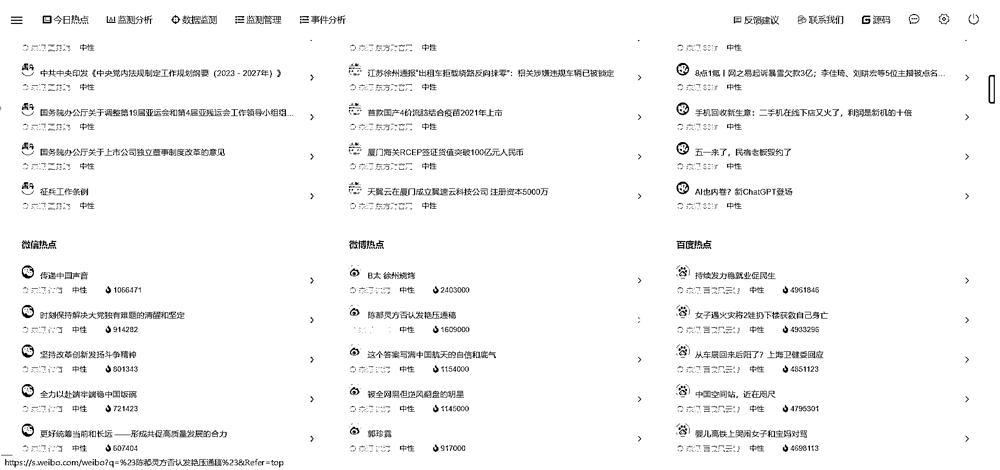

# 免费舆论数据搜索系统，能实时获取各大平台最新文章

> 原文：[`www.yuque.com/for_lazy/xkrm14/ngcda3mt9n31wkdm`](https://www.yuque.com/for_lazy/xkrm14/ngcda3mt9n31wkdm)

作者： 六经注

日期：2023-04-25

点赞数：41

正文：

免费舆论数据搜索系统，能实时获取各大平台最新文章 （） 1、聚合了多个搜索引擎，包含了财经、社交平台等内容的获取； 2、采集数据量挺大的，还实时~ 3、支持自定义要检索的关键字[登录·网络情报分析系统](http://open-yuqing.stonedt.com/)

  

  

  

  

评论区：

六经注 : 如果要关注公众号，直接输入密码：stonedt123 就可以了，它的所有体验账号用的都是一样的。 具体介绍可以在 gitee 上看开源的信息

公众号懒人找资源，懒人专属群分享

</ne-p></ne-p></ne-p></ne-p>