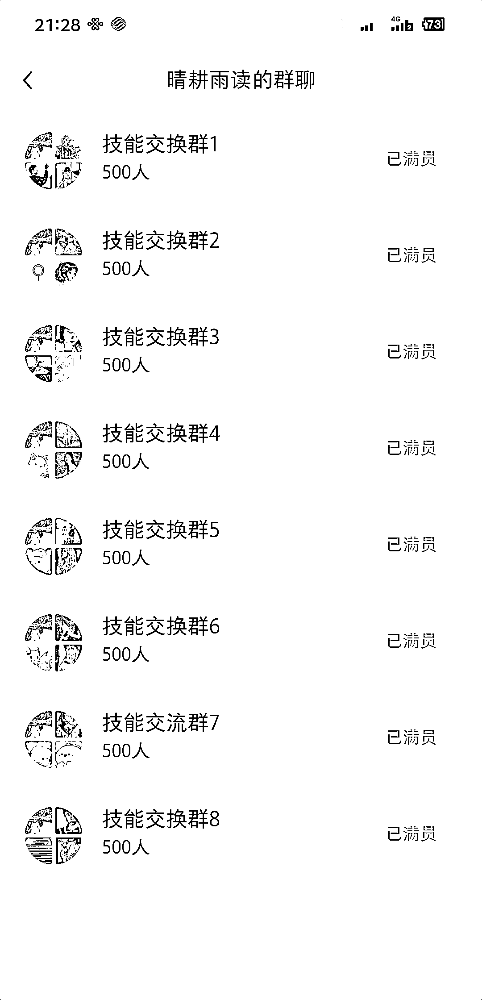

# 小红书发“技能交换”，留言爆了

> 原文：[`www.yuque.com/for_lazy/xkrm14/hdqb3zhc48gozhr1`](https://www.yuque.com/for_lazy/xkrm14/hdqb3zhc48gozhr1)

<ne-text id="ucd14dc32">作者： Dyna</ne-text>

<ne-text id="u0c6bc99c">日期：2023-05-03</ne-text>

<ne-text id="uebe7ee3e">点赞数：</ne-text><ne-text id="u9300f303" ne-bold="true">135</ne-text>

<ne-hole id="uaa7893f5" data-lake-id="uaa7893f5"><ne-card data-card-name="hr" data-card-type="block" id="F1KzF" data-event-boundary="card">

<ne-text id="ucfa62165">正文：</ne-text>

<ne-text id="ue99115ff">小红书发“技能交换”，下面留言的爆了，8 个群加满了</ne-text>

<ne-card data-card-name="image" data-card-type="inline" id="PXGBR" data-event-boundary="card">  <ne-p id="u485941a7" data-lake-id="u485941a7"><ne-card data-card-name="image" data-card-type="inline" id="l6oTh" data-event-boundary="card">  <ne-p id="u4241b0c7" data-lake-id="u4241b0c7"><ne-card data-card-name="image" data-card-type="inline" id="cNMPf" data-event-boundary="card">  <ne-hole id="uae520665" data-lake-id="uae520665"><ne-card data-card-name="hr" data-card-type="block" id="Ij9hp" data-event-boundary="card"><ne-p id="u94514a1f" data-lake-id="u94514a1f"><ne-text id="ud9367a0c">评论区：</ne-text>

<ne-text id="u1f09da5f">平凡 : 同理 这个思路应该在其他平台也可以试试</ne-text>

<ne-text id="u9f1f99ee">Dyna : 互动性很强</ne-text>

<ne-text id="u634ba539">coco : 怎么变现呢</ne-text>

<ne-text id="u5402685a">徐浩然 : 加过一个，后来也没看内容了</ne-text>

<ne-text id="uc8aeb779">周彦充 : 666，已收藏，感觉很不错</ne-text>

<ne-text id="u621edea7">Dyna : 可以在群里发资料引流到私域。这是我暂时想到的。</ne-text>

<ne-text id="udbc9d0b9">林家少爷 : 具体怎么变现 引流是可以，后续变现也是大头</ne-text>

<ne-text id="ufc758c45">彦威 : 变现的话，可以卖课程</ne-text>

<ne-hole id="ud90f78b2" data-lake-id="ud90f78b2"><ne-card data-card-name="hr" data-card-type="block" id="jhdQY" data-event-boundary="card">

<ne-text id="u15f4c8af">公众号懒人找资源，懒人专属群分享</ne-text>

</ne-card></ne-hole></ne-card></ne-hole></ne-card></ne-p></ne-card></ne-p></ne-card></ne-p></ne-card></ne-hole>