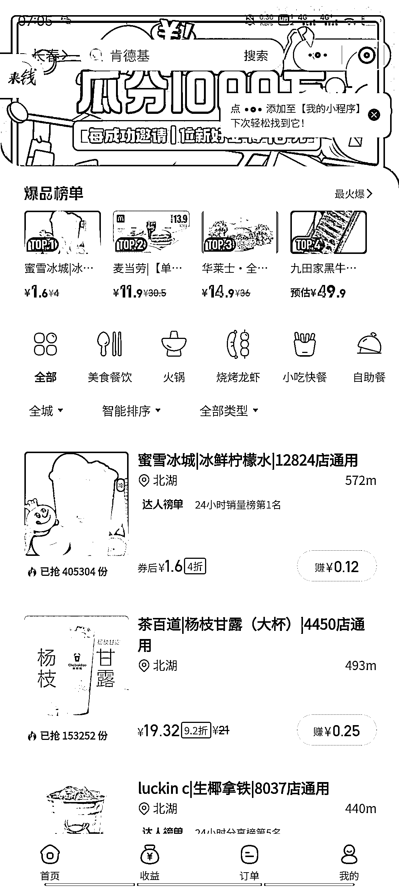

# 美团圈圈引流方式

> 原文：[`www.yuque.com/for_lazy/xkrm14/cmvu8fv6g8y4rhak`](https://www.yuque.com/for_lazy/xkrm14/cmvu8fv6g8y4rhak)

作者： 一诺

日期：2023-05-03

点赞数：53

正文：

昨天加入了美团圈圈，发现我知道的比较晚，之前风向标已经有人发过 我今天就补充几个引流方法，希望对大家可以有所帮助 ①美团外卖都有商家电话，不愿意地推，可以给他们打电话进行介绍，每个商家都有自己家的微信群！推广起来会方便很多 ②可以找当小区的团购群，学生群，宝妈群进行分享 ③对接以前的淘客群主，他们手机的资源都很多 ④去蜜雪冰城店门口，扫码请人喝柠檬水，推广一单挣 10，买柠檬水花 1.6-3.1，重要的是以后订外卖你都有返佣 目前开放的城市还不是特别多，可以先成为第一批达人，占领先机

  

评论区：

along : 感觉可以搞

代文刀 : 美团圈圈不支持外卖吧，定外卖怎么返佣

叫我去吃饭 : 现在好像还是邀请制 可以私信你要邀请码吗

一诺 : 可以的

一诺 : 目前不支持，不知道后续会不会支持

陈花花 : 推广一单挣 10 元是推广的佣金吗？

一诺 : 是的，推广的佣金

公众号懒人找资源，懒人专属群分享

